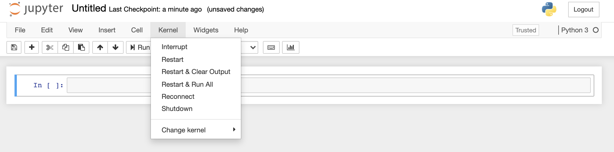

## Use the Jupyter Notebook for editing and running Python.

Python scripts are text files containing lines of Python code which are run sequentially by a Python interpreter.
While it's common to write Python scripts using a text editor, which can be run from the command line, we are going to use the [Jupyter Notebook][jupyter] for this course. 
This has several advantages:
*   You can easily type, edit, and copy and paste blocks of code, which can then be run to produce output, either within the notebook or separately (as for a regular Python script).
*   Tab complete allows you to easily access the names of things you are using
        and learn more about them.
*   It allows you to annotate your code with links, different sized text, bullets, etc.
        to make it more accessible to you and your collaborators.
*   It allows you to display figures next to the code that produces them
        to tell a complete story of the analysis.
*   Each notebook contains one or more cells that contain code, text, or images.

Notebook files have the extension `.ipynb` to distinguish them from plain-text Python programs. Howeve, they can be exported as Python scripts that can be run from the command line.

> ## How It's Stored
>
> *   The notebook file is stored in a format called JSON.
> *   Just like a webpage, what's saved looks different from what you see in your browser.
> *   But this format allows Jupyter to mix source code, text, and images, all in one file.
{: .callout}

> ## Code vs. Text
>
> Jupyter mixes code and text in different types of blocks, called cells. We often use the term
> "code" to mean "the source code of software written in a language such as Python".
> A "code cell" in a Notebook is a cell that contains software;
> a "text cell" is one that contains ordinary prose written for human beings.
{: .callout}

## The Notebook has Command and Edit modes.

*   If you press <kbd>Esc</kbd> and <kbd>Return</kbd> alternately, the outer border of your code cell will change from gray to blue.
*   These are the **Command** (gray) and **Edit** (blue) modes of your notebook.
*   Command mode allows you to edit notebook-level features, and Edit mode changes the content of cells.
*   When in Command mode (esc/gray),
    *   The <kbd>b</kbd> key will make a new cell below the currently selected cell.
    *   The <kbd>a</kbd> key will make one above.
    *   The <kbd>x</kbd> key will delete the current cell.
    *   The <kbd>z</kbd> key will undo your last cell operation (which could be a deletion, creation, etc).
*   All actions can be done using the menus, but there are lots of keyboard shortcuts to speed things up.

> ## Command Vs. Edit
>
> In the Jupyter notebook page are you currently in Command or Edit mode?  
> Switch between the modes. 
> Use the shortcuts to generate a new cell. 
> Use the shortcuts to delete a cell.
> Use the shortcuts to undo the last cell operation you performed.
>
> > ## Solution
> >
> > Command mode has a grey border and Edit mode has a blue border. 
> > Use <kbd>Esc</kbd> and <kbd>Return</kbd> to switch between modes. 
> > You need to be in Command mode (Press <kbd>Esc</kbd> if your cell is blue).  Type <kbd>b</kbd> or <kbd>a</kbd>.
> > You need to be in Command mode (Press <kbd>Esc</kbd> if your cell is blue).  Type <kbd>x</kbd>.
> > You need to be in Command mode (Press <kbd>Esc</kbd> if your cell is blue).  Type <kbd>z</kbd>.
> {: .solution}
{: .challenge}

### Use the keyboard and mouse to select and edit cells.

*   Pressing the <kbd>Return</kbd> key turns the border blue and engages Edit mode, which allows 
    you to type within the cell.
*   Because we want to be able to write many lines of code in a single cell,
    pressing the <kbd>Return</kbd> key when in Edit mode (blue) moves the cursor to the next line 
    in the cell just like in a text editor.
*   We need some other way to tell the Notebook we want to run what's in the cell.
*   Pressing <kbd>Shift</kbd>+<kbd>Return</kbd> together will execute the contents of the cell.
*   Notice that the <kbd>Return</kbd> and <kbd>Shift</kbd> keys on the right of the keyboard are 
    right next to each other.

### The Notebook will turn Markdown into formatted text.

*   Notebooks can also render [Markdown][markdown].
    *   A simple plain-text format for writing lists, links, 
        and other things that might go into a web page.
    *   Equivalently, a subset of HTML that looks like what you'd send in an old-fashioned email.
*   Turn the current cell into a Markdown cell by entering the Command mode (<kbd>Esc</kbd>/gray) 
    and press the <kbd>M</kbd> key.
*   `In [ ]:` will disappear to show it is no longer a code cell and you will be able to write in 
    Markdown.
*   Markdown cells have to be executed similar to Python cells with <kbd>Shift</kbd>+<kbd>Return</kbd>.    
*   Turn the current cell into a Code cell by entering the Command mode (<kbd>Esc</kbd>/gray) and press the <kbd>y</kbd> key.

### Markdown does most of what HTML does.

  

~~~
*   Use asterisks
*   to create
*   bullet lists.
~~~
  

  

*   Use asterisks
*   to create
*   bullet lists.
  

  

~~~
1.  Use numbers
1.  to create
1.  numbered lists.
~~~
  

  

1.  Use numbers
1.  to create
1.  numbered lists.
  

  

~~~
*  You can use indents
	*  To create sublists 
	*  of the same type
*  Or sublists
	1. Of different
	1. types
~~~
  

  

*  You can use indents
	*  To create sublists
	*  of the same type
*  Or sublists
	1. Of different
	1. types
  

  

~~~
# A Level-1 Heading
~~~
  

  

# A Level-1 Heading
  

  

~~~
## A Level-2 Heading (etc.)
~~~
  

  

## A Level-2 Heading (etc.)
  

  

~~~
Line breaks
don't matter.

But blank lines
create new paragraphs.
~~~
  

  

Line breaks
don't matter.

But blank lines
create new paragraphs.
  

  

~~~
[Create links](http://software-carpentry.org) with `[...](...)`.
Or use [named links][data_carpentry].

[data_carpentry]: http://datacarpentry.org
~~~
  

  

[Create links](http://software-carpentry.org) with `[...](...)`.
Or use [named links][data_carpentry].

[data_carpentry]: http://datacarpentry.org
  

> ## Creating Lists in Markdown
>
> Create a nested list in a Markdown cell in a notebook that looks like this:
>
> 1.  Get funding.
> 2.  Do work.
>     *   Design experiment.
>     *   Collect data.
>     *   Analyze.
> 3.  Write up.
> 4.  Publish.
> 
> > ## Solution
> >
> > This challenge integrates both the numbered list and bullet list. 
> > Note that the bullet list is indented 2 spaces so that it is inline with the items of the numbered list.
> > ~~~
> > 1.  Get funding.
> > 2.  Do work.
> >     *   Design experiment.
> >     *   Collect data.
> >     *   Analyze.
> > 3.  Write up.
> > 4.  Publish.
> > ~~~
> {: .solution}
{: .challenge}

> ## More Math
>
> What is displayed when a Python cell in a notebook
> that contains several calculations is executed?
> For example, what happens when this cell is executed?
>
> ~~~
> 7 * 3
> 2 + 1
> ~~~
> {: .language-python}
> 
> > ## Solution
> >
> > Python returns the output of the last calculation.
> > ~~~
> > 3
> > ~~~
> > {: .language-python}
> {: .solution}
{: .challenge}

> ## Change an Existing Cell from Code to Markdown
>
> What happens if you write some Python in a code cell
> and then you switch it to a Markdown cell?
> For example,
> put the following in a code cell:
>
> ~~~
> x = 6 * 7 + 12
> print(x)
> ~~~
> {: .language-python}
>
> And then run it with <kbd>Shift</kbd>+<kbd>Return</kbd> to be sure that it works as a code cell.
> Now go back to the cell and use <kbd>Esc</kbd> then <kbd>m</kbd> to switch the cell to Markdown
> and "run" it with <kbd>Shift</kbd>+<kbd>Return</kbd>.
> What happened and how might this be useful?
> 
> > ## Solution
> >
> > The Python code gets treated like Markdown text.
> > The lines appear as if they are part of one contiguous paragraph.
> > This could be useful to temporarily turn on and off cells in notebooks that get used for multiple purposes. 
> > ~~~
> > x = 6 * 7 + 12 print(x)
> > ~~~
> > {: .language-python}
> {: .solution}
{: .challenge}

> ## Equations
>
> Standard Markdown (such as we're using for these notes) won't render equations,
> but the Notebook will.
> Create a new Markdown cell
> and enter the following:
>
> ~~~
> $\sum_{i=1}^{N} 2^{-i} \approx 1$
> ~~~
>
> (It's probably easier to copy and paste.)
> What does it display?
> What do you think the underscore, `_`, circumflex, `^`, and dollar sign, `$`, do?
> 
> > ## Solution
> >
> > The notebook shows the equation as it would be rendered from LaTeX equation syntax.
> > The dollar sign, `$`, is used to tell Markdown that the text in between is a LaTeX equation.
> > If you're not familiar with LaTeX,  underscore, `_`, is used for subscripts and circumflex, `^`, is used for superscripts.
> > A pair of curly braces, `{` and `}`, is used to group text together so that the statement `i=1` becomes the subscript and `N` becomes the superscript.
> > Similarly, `-i` is in curly braces to make the whole statement the superscript for `2`.
> > `\sum` and `\approx` are LaTeX commands for "sum over" and "approximate" symbols. 
> {: .solution}
{: .challenge}
~~~

## Keeping track

It's important to bear in mind that the notebook remembers the sequence that you run the cells. So even if cells follow a particular order in the notebook, you can run them out of sequence as long as the code allows it (e.g. required variables have been defined or calculated in one of the cells that has been run). The code will behave just as if it is written in the order that the cells are run. This can lead to confusing behaviour and errors if you run one or more cells out of sequence or skip over cells.

If you have run cells out of sequence and want to start from the beginning again, you should _Restart_ the kernel _and Clear Output_ (see below).

## Getting stuck: restarting the kernel

Sometimes you may find that the notebook stops running code, or that code you wrote  takes far too long to run, so you want to try another approach. In these cases you can interrupt and/or restart the notebook kernel (the computational engine that runs the code). You can do this via the menu bar at the top of the notebook. _Interrupt_ will interrupt the running of the code from the cell that is being run at the time and prevent any new cells from being run. _Restart_ is then required to start running code again. _Restart and Clear Output_ will also clear the memory of all outputs including variables stored in memory __and any loaded modules__. This can be useful if you are testing the code in a module and need to reload the new version to test again.

## Saving and Quitting

When you want to quit a notebook, be sure to save it first using _Save and Checkpoint_ in the _File_ menu.  In fact it is wise to save the notebook regularly if you are adding to it or making changes. It is also good practice to exit the notebook cleanly so it doesn't hang, using _Close and Halt_ in the _File_ menu, before closing the notebook browser tab.

[anaconda]: https://docs.continuum.io/anaconda/install
[jupyterlab-notebook-docs]: https://jupyterlab.readthedocs.io/en/stable/user/notebook.html
[markdown]: https://en.wikipedia.org/wiki/Markdown


