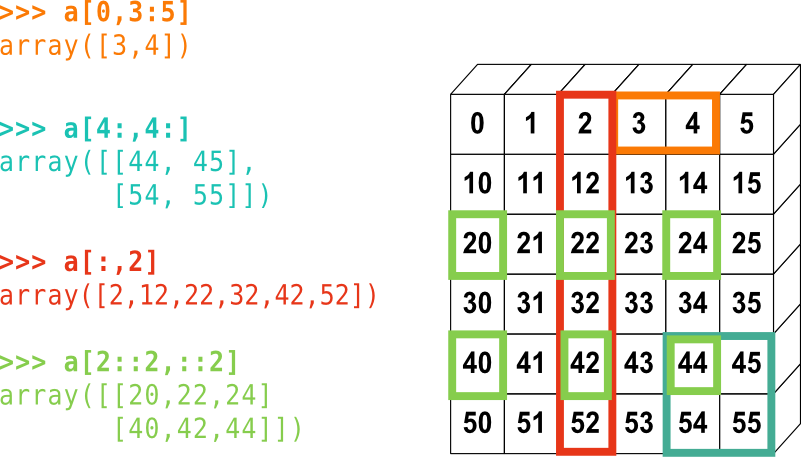

## Array Basics

Numpy arrays, are objects of class _ndarray_, corresponding to homogeneous and potentially
multidimensional 'tables', typically containing numbers but which may contain other variable types.
The items in the array are indexed by a tuple of integers, with each dimension corresponding to an axis. They can have as many axes (and thus dimensions) as needed.

We can convert a list into a numpy array. Arrays are printed using square brackets, like lists, but with spaces instead of commas between items. You cannot define an array using this format however, you need to use a numpy function to do that:

~~~
import numpy as np # We will import numpy and create a shorter 'alias' for it

# This is a 1d array:
a = np.array([1,2,3])
print("1d array: ",a)

# This is a 2d array:
b = np.array([[1,2,3],[3,4,5]])
print("2d array:")
print(b)

# This is a 3d array:
c = np.array([[[1,2,3],[4,5,6],[7,8,9],[10,11,12]],[[21,22,23],[24,25,26],
[27,28,29],[30,31,32]]])
print("3d array:")
print(c)
~~~
{: .language-python}
~~~
1d array:  [1 2 3]
2d array:
[[1 2 3]
 [3 4 5]]
3d array:
[[[ 1  2  3]
 [ 4  5  6]
 [ 7  8  9]
 [10 11 12]]

[[21 22 23]
 [24 25 26]
 [27 28 29]
 [30 31 32]]]
~~~
{: .output}

Note that for printing purposes, the last axis is printed from left to right and the second-to-last is printed from top to bottom on consecutive lines. The rest are also printed from top to bottom, with each slice separated by an empty line.

You can find the morphology of the array using various numpy 
[methods]({{ page.root }}/reference/#method):

~~~
print("1d array a:")
print("Number of axes: ",a.ndim," and length of each axis: ",a.shape) 

print("2d array b:")
print("Number of axes: ",b.ndim," and length of each axis: ",b.shape) 

print("3d array c:")
print("Number of axes: ",b.ndim," and length of each axis: ",c.shape) 
~~~
{: .language-python}

~~~
1d array a:
Number of axes:  1  and length of each axis:  (3,)
2d array b:
Number of axes:  2  and length of each axis:  (2, 3)
3d array c:
Number of axes:  2  and length of each axis:  (2, 4, 3)
~~~
{: .output}

> ## Array Indexing
>
> Numpy arrays are indexed using _row-major_ order, that is in a 2-dimensional array, values are 
> stored consecutively in memory along the rows of the array, and the first index corresponds to 
> the row, the second index the columns (the same as in matrix indexing, but opposite to Cartesian coordinates):
>
> 

> 
> 

>
> More generally (e.g. for arrays with additional dimensions), the last index in the sequence
> is the one which is stepped through the fastest in memory, i.e. we read along the columns 
> before we get to the next row.
{: .callout}

The `size` method gives the total number of elements in the array. We can also output the data type using the `dtype` method:

~~~
print("Array c:")
print("total number of elements: ",c.size)
print("data type of elements: ", c.dtype)
~~~
{: .language-python}
~~~
Array c:
total number of elements:  24
data type of elements:  int64
~~~
{: .output}

Array elements can consist of all the different data types. Unless otherwise specified, the type will be chosen that best fits the values you use to create the array.

Just like lists, arrays can be iterated through using loops, starting with the first axis:

~~~
print("For array a:")
for val in a:
    print(val,val**(1/3))

print("For array c:")
for j, arr in enumerate(c):
    print("Sub-array",j,"=",arr)
    for k, vec in enumerate(arr):
        print("Vector",k,"of sub-array",j,"=",vec)
~~~
{: .language-python}
~~~
For array a:
1 1.0
2 1.2599210498948732
3 1.4422495703074083
For array c:
Sub-array 0 = [[ 1  2  3]
 [ 4  5  6]
 [ 7  8  9]
 [10 11 12]]
Vector 0 of sub-array 0 = [1 2 3]
Vector 1 of sub-array 0 = [4 5 6]
Vector 2 of sub-array 0 = [7 8 9]
Vector 3 of sub-array 0 = [10 11 12]
Sub-array 1 = [[21 22 23]
 [24 25 26]
 [27 28 29]
 [30 31 32]]
Vector 0 of sub-array 1 = [21 22 23]
Vector 1 of sub-array 1 = [24 25 26]
Vector 2 of sub-array 1 = [27 28 29]
Vector 3 of sub-array 1 = [30 31 32]
~~~
{: .output}

However, numpy allows much faster access to the component parts of an array through slicing,
and much faster operations on arrays using the numpy ufuncs.

> ## Array Slicing
> 
> Numpy arrays use the same rules for slicing as other Python iterables such as lists and strings.
>
>> ## Challenge
>>
> >Without running the code first, what will the following print statements show?
>>
>> ~~~
>> d = np.array([0,1,2,3,4,5,6])
>>
>> print(d[1:])
>> print(d[2:4])
>> print(d[-1])
>> print(d[::2])
>> print(d[-1:1:-1])
>> ~~~
>> {: .language-python}
>>> ## Solution
>>> ~~~
>>> [1 2 3 4 5 6]
>>> [2 3]
>>> 6
>>> [0 2 4 6]
>>> [6 5 4 3 2]
>>> ~~~
>>> {: .output}
>> {: .solution}
> {: .challenge}
> 
> Slicing in two dimensions:
>
>

> 
> 

>
>> ## Challenge
>>
>> Without running the code first, for the 3D matrix `c` defined earlier, what would 
>> `print(c[-1,1:3,::2])` show?
>>
>>> ## Solution
>>>
>>> ~~~
>>> [[24 26]
>>> [27 29]]
>>> ~~~
>>> {: .output}
>> {: .solution}
> {: .challenge}
>
{: .callout}

## Making Simple Starting Arrays

It's often useful to create a simple starting array of elements that can be modified or written to 
later on. Some simple ways to do this are shown here - the shape of the new array is specified using a tuple (or single integer if 1-D).

~~~
a = np.zeros((2,3)) # Fill the array with 0.
print("a =",a)

b = np.ones((4,4)) # Fill with 1.
print("b =",b)

c = np.full(10,3.0) # Fill with the value given
print("c =",c)
~~~
{: .language-python}
~~~
a = [[0. 0. 0.]
 [0. 0. 0.]]
b = [[1. 1. 1. 1.]
 [1. 1. 1. 1.]
 [1. 1. 1. 1.]
 [1. 1. 1. 1.]]
c = [3. 3. 3. 3. 3. 3. 3. 3. 3. 3.]
~~~
{: .output}

## Making Evenly Spaced and Meshgrid Arrays

Besides building an array by hand,  we can generate arrays automatically in a variety of ways. 
Firstly, there are a variety of numpy functions to generate arrays of evenly spaced numbers. 
`arange` generates numbers with a fixed interval (or `step`) between them:

~~~
a = np.arange(8) # Generates linearly spaced numbers. Default step size = 1.0 and start = 0.0
print("a =",a)

b = np.arange(start=3, stop=12, step=0.8) # The stop value is excluded
print("b =",b)
~~~
{: .language-python}
~~~
a = [0 1 2 3 4 5 6 7]
b = [ 3.   3.8  4.6  5.4  6.2  7.   7.8  8.6  9.4 10.2 11.  11.8]
~~~
{: .output}

The `linspace` function produces `num` numbers over a fixed range inclusive of the start and stop 
value. `geomspace` and `logspace` work in a similar way to produce geometrically spaced values 
(i.e. equivalent to linear spacing of the logarithm of the values).  Note that we don't need to specify 
the argument names if they are written in the correct order for the function. There are also a number 
of hidden default variables that may be specified if we wish - you should always check the 
documentation for a function before you use it, either via an online search or using the help 
functionality in the Notebook or python command-line.

~~~
c = np.geomspace(10.0,1e6,6)
print("c =",c)

d = np.logspace(1,6,6)
print("d =",d)
~~~
{: .language-python}
~~~
c = [1.e+01 1.e+02 1.e+03 1.e+04 1.e+05 1.e+06]
d = [1.e+01 1.e+02 1.e+03 1.e+04 1.e+05 1.e+06]
~~~
{: .output}

`linspace` and `geomspace` also accept arrays of `stop`, `start` and `num` to produce multidimensional arrays of numbers. 

`meshgrid` is a particularly useful function that accepts _N_ 1-D arrays to produce _N_  _N_-D grids of coordinates. Each point in a grid shows the coordinate value of the corresponding axis. These can be used to, e.g. evaluate functions across a grid of parameter values or make 3-D plots or contour plots of surfaces.

~~~
x = np.linspace(21,30,10)
y = np.linspace(100,800,8)

xgrid1, ygrid1 = np.meshgrid(x,y,indexing='xy') # Use Cartesian (column-major order) indexing
xgrid2, ygrid2 = np.meshgrid(x,y,indexing='ij') # Use matrix (row-major order) indexing

print("Using Cartesian (column-major order) indexing:")
print("Grid of x-values:")
print(xgrid1,"\n") # Add a newline after printing the grid
print("Grid of y-values:")
print(ygrid1,"\n") 

print("Using matrix (row-major order) indexing:")
print("Grid of x-values:")
print(xgrid2,"\n")
print("Grid of y-values:")
print(ygrid2,"\n")
~~~
{: .language-python}

Note that the printed grids begin in the top-left corner with the _[0,0]_ position, but the column and row values are then reversed for _xy_ vs _ij_ indexing.

~~~
Using Cartesian (column-major order) indexing:
Grid of x-values:
[[21. 22. 23. 24. 25. 26. 27. 28. 29. 30.]
 [21. 22. 23. 24. 25. 26. 27. 28. 29. 30.]
 [21. 22. 23. 24. 25. 26. 27. 28. 29. 30.]
 [21. 22. 23. 24. 25. 26. 27. 28. 29. 30.]
 [21. 22. 23. 24. 25. 26. 27. 28. 29. 30.]
 [21. 22. 23. 24. 25. 26. 27. 28. 29. 30.]
 [21. 22. 23. 24. 25. 26. 27. 28. 29. 30.]
 [21. 22. 23. 24. 25. 26. 27. 28. 29. 30.]] 

Grid of y-values:
[[100. 100. 100. 100. 100. 100. 100. 100. 100. 100.]
 [200. 200. 200. 200. 200. 200. 200. 200. 200. 200.]
 [300. 300. 300. 300. 300. 300. 300. 300. 300. 300.]
 [400. 400. 400. 400. 400. 400. 400. 400. 400. 400.]
 [500. 500. 500. 500. 500. 500. 500. 500. 500. 500.]
 [600. 600. 600. 600. 600. 600. 600. 600. 600. 600.]
 [700. 700. 700. 700. 700. 700. 700. 700. 700. 700.]
 [800. 800. 800. 800. 800. 800. 800. 800. 800. 800.]] 

Using matrix (row-major order) indexing:
Grid of x-values:
[[21. 21. 21. 21. 21. 21. 21. 21.]
 [22. 22. 22. 22. 22. 22. 22. 22.]
 [23. 23. 23. 23. 23. 23. 23. 23.]
 [24. 24. 24. 24. 24. 24. 24. 24.]
 [25. 25. 25. 25. 25. 25. 25. 25.]
 [26. 26. 26. 26. 26. 26. 26. 26.]
 [27. 27. 27. 27. 27. 27. 27. 27.]
 [28. 28. 28. 28. 28. 28. 28. 28.]
 [29. 29. 29. 29. 29. 29. 29. 29.]
 [30. 30. 30. 30. 30. 30. 30. 30.]] 

Grid of y-values:
[[100. 200. 300. 400. 500. 600. 700. 800.]
 [100. 200. 300. 400. 500. 600. 700. 800.]
 [100. 200. 300. 400. 500. 600. 700. 800.]
 [100. 200. 300. 400. 500. 600. 700. 800.]
 [100. 200. 300. 400. 500. 600. 700. 800.]
 [100. 200. 300. 400. 500. 600. 700. 800.]
 [100. 200. 300. 400. 500. 600. 700. 800.]
 [100. 200. 300. 400. 500. 600. 700. 800.]
 [100. 200. 300. 400. 500. 600. 700. 800.]
 [100. 200. 300. 400. 500. 600. 700. 800.]] 
~~~
{: .output}

## Editing and Appending

To edit specific values of an array, you can simply replace the values using slicing, e.g.:

~~~
z = np.zeros((8,6))
z[2::2,2:-1] = 1
print(z)
~~~
{: .language-python}
~~~
[[0. 0. 0. 0. 0. 0.]
[0. 0. 0. 0. 0. 0.]
[0. 0. 1. 1. 1. 0.]
[0. 0. 0. 0. 0. 0.]
[0. 0. 1. 1. 1. 0.]
[0. 0. 0. 0. 0. 0.]
[0. 0. 1. 1. 1. 0.]
[0. 0. 0. 0. 0. 0.]]
~~~
{: .output}

Additional elements can be added to the end of the array using `append`, or inserted before a specified index/indices using `insert`. Elements may be removed using `delete`.

~~~
a = np.arange(2,8)
print(a)
b = np.append(a,[8,9]) # Appends [8,9] to end of array
print(b)
c = np.insert(b,5,[21,22,23]) # Inserts [21,22,23] before element with index 5
print(c)
d = np.delete(c,[0,3,6]) # Deletes elements with index 0, 3, 6
print(d)
~~~
{: .language-python}
~~~
[2 3 4 5 6 7]
[2 3 4 5 6 7 8 9]
[ 2  3  4  5  6 21 22 23  7  8  9]
[ 3  4  6 21 23  7  8  9]
~~~
{: .output}

If we want to append to a multi-dimensional array, but do not specify an axis, the arrays will 
be _flattened_ (see `ravel` below) before appending, to produce a 1-D array. If we specify an axis, the array we append must have the same number of dimensions and the same shape along the other axes. E.g.:

~~~
a = np.zeros((3,8))
print(a,"\n")

b = np.append(a,np.ones((3,1)),axis=1)
print(b,"\n")

c = np.append(b,np.full((2,9),2.),axis=0)
print(c,"\n")

d = np.append(c,np.full((3,1),3.),axis=1)
print(d)
~~~
{: .language-python}
~~~
[[0. 0. 0. 0. 0. 0. 0. 0.]
 [0. 0. 0. 0. 0. 0. 0. 0.]
 [0. 0. 0. 0. 0. 0. 0. 0.]] 

[[0. 0. 0. 0. 0. 0. 0. 0. 1.]
 [0. 0. 0. 0. 0. 0. 0. 0. 1.]
 [0. 0. 0. 0. 0. 0. 0. 0. 1.]] 

[[0. 0. 0. 0. 0. 0. 0. 0. 1.]
 [0. 0. 0. 0. 0. 0. 0. 0. 1.]
 [0. 0. 0. 0. 0. 0. 0. 0. 1.]
 [2. 2. 2. 2. 2. 2. 2. 2. 2.]
 [2. 2. 2. 2. 2. 2. 2. 2. 2.]] 

---------------------------------------------------------------------------
ValueError                                Traceback (most recent call last)
<ipython-input-65-6a09bd69590d> in <module>
      8 print(c,"\n")
      9 
---> 10 d = np.append(c,np.full((3,1),3.),axis=1)
     11 print(d)

<__array_function__ internals> in append(*args, **kwargs)

~/anaconda3/lib/python3.7/site-packages/numpy/lib/function_base.py in append(arr, values, axis)
   4698         values = ravel(values)
   4699         axis = arr.ndim-1
-> 4700     return concatenate((arr, values), axis=axis)
   4701 
   4702 

<__array_function__ internals> in concatenate(*args, **kwargs)

ValueError: all the input array dimensions for the concatenation axis must match exactly, but along dimension 0, the array at index 0 has size 5 and the array at index 1 has size 3
~~~
{: .output}

> ## Copying Arrays
>
> You might think that we can make a direct copy `b` of a Numpy array `a` using `a = b`.  But look 
> what happens if we change a value in `a`:
>
> ~~~
> a = [5.,4.,3.,9.]
> b = a
> print("b =",b)
> a[2] = 100.
> print("b =",b)
> ~~~
> {: .language-python}
> ~~~
> b = [5. 4. 3. 9.]
> b = [  5.   4. 100.   9.]
> ~~~
> {: .output}
> 
> The new array variable _b_ is just another label for the array `a`, so any changes to `a` are also
> mirrored in `b`, usually with undesirable results! If we want to make an independent copy of an
> array, we can use numpy's `copy` function. Alternatively, we can carry out an operation on the
> original array which doesn't change it (most operations write a new array by default).  For 
> example, both this:
>
> ~~~
> a = np.array([5.,4.,3.,9.])
> b = np.copy(a)
> print("b =",b)
> a[2] = 100.
> print("b =",b) 
> ~~~
> {: .language-python}
>
> and this:
>
> ~~~ 
> a = np.array([5.,4.,3.,9.])
> b = a + 0
> print("b =",b)
> a[2] = 100.
> print("b =",b)
> ~~~
> {: .language-python}
>
> will make `b` a completely new array which starts out identical to `a` but is independent of 
> any changes to `a`:
>
> ~~~
> b = [5. 4. 3. 9.]
> b = [5. 4. 3. 9.]
> ~~~
> {: .output}
{: .callout}

## Reshaping and Stacking

Sometimes it can be useful to change the shape of an array. For example, this can make some
data analysis easier (e.g. to make distinct rows or columns in the data) or allow you to apply 
certain functions which may otherwise be impossible due to the array not having the correct shape
(e.g. see _broadcasting_ in the next episode).

Numpy's `reshape` function allows an array to be reshaped to a different array of the same size
(so the product of row and column lengths should be the same as in the original array). The 
reshaping is done by reading out the elements in (C-like) row-major order (`order='C'`), i.e. last 
index changing fastest, then the 2nd-to-last etc. or (Fortran-like) column-major order (`order='F'`), 
with first index changing fastest. The elements of the new array are then populated on the same basis. For example:

~~~
a = np.linspace([1,11,21],[8,18,28],8)
print(a,"\n")

b = np.reshape(a,(2,12)) # The default order='C'
print(b,"\n")

c = np.reshape(a,(3,8))
print(c,"\n")

d = np.reshape(a,(3,8),order='F')
print(d)
~~~
{: .language-python}
~~~
[[ 1. 11. 21.]
 [ 2. 12. 22.]
 [ 3. 13. 23.]
 [ 4. 14. 24.]
 [ 5. 15. 25.]
 [ 6. 16. 26.]
 [ 7. 17. 27.]
 [ 8. 18. 28.]] 

[[ 1. 11. 21.  2. 12. 22.  3. 13. 23.  4. 14. 24.]
 [ 5. 15. 25.  6. 16. 26.  7. 17. 27.  8. 18. 28.]] 

[[ 1. 11. 21.  2. 12. 22.  3. 13.]
 [23.  4. 14. 24.  5. 15. 25.  6.]
 [16. 26.  7. 17. 27.  8. 18. 28.]] 

[[ 1.  4.  7. 12. 15. 18. 23. 26.]
 [ 2.  5.  8. 13. 16. 21. 24. 27.]
 [ 3.  6. 11. 14. 17. 22. 25. 28.]]
~~~
{: .output}

It's common to want to reshape the array so that the columns are swapped into rows and vice 
versa, i.e. the equivalent of a matrix transpose. 
This cannot be done using reshape since the function reads along whole rows 
(or columns) as it populates the new array. Instead, you can use the `transpose` function 
or the `.T` method:

~~~
e = np.transpose(a)
print(e,"\n")

f = a.T
print(f,"\n")
~~~
{: .language-python}
~~~
[[ 1.  2.  3.  4.  5.  6.  7.  8.]
 [11. 12. 13. 14. 15. 16. 17. 18.]
 [21. 22. 23. 24. 25. 26. 27. 28.]] 

[[ 1.  2.  3.  4.  5.  6.  7.  8.]
 [11. 12. 13. 14. 15. 16. 17. 18.]
 [21. 22. 23. 24. 25. 26. 27. 28.]]
~~~
{: .output}

It's sometimes useful to _flatten_ a multi-dimensional array, i.e. read it out into a single dimension.
This is often also done by functions where the inputs are multi-dimensional and the output is otherwise not defined or ambiguous (e.g. if an axis to operate on is not specified). Flattening can be done using the `ravel` function. As for reshape, an `order` argument can be given to tell the function which index to read first.

~~~
g = np.ravel(a)
print(g,"\n")

h = np.ravel(a,order='F')
print(h)
~~~
{: .language-python}
~~~
[ 1. 11. 21.  2. 12. 22.  3. 13. 23.  4. 14. 24.  5. 15. 25.  6. 16. 26.
  7. 17. 27.  8. 18. 28.] 

[ 1.  2.  3.  4.  5.  6.  7.  8. 11. 12. 13. 14. 15. 16. 17. 18. 21. 22.
 23. 24. 25. 26. 27. 28.]
~~~
{: ,output}

Finally, there are a number of useful functions for _"stacking"_ arrays together, which is useful when combining e.g. arrays of different variables obtained from the same series of measurements. For example, `column_stack` can be used to stack together 1-D arrays as columns or 2-D arrays on top of one another. `hstack` and `vstack` stack arrays in sequence horizontally (i.e. by column) or vertically (by row):

~~~
arr1 = np.arange(8)
arr2 = np.arange(11,19)
print(arr1,arr2,"\n")

print(np.column_stack((arr1,arr2)),"\n")

print(np.hstack((arr1,arr2)),"\n")

print(np.vstack((arr1,arr2)))
~~~
{: .language-python}
~~~
[0 1 2 3 4 5 6 7] [11 12 13 14 15 16 17 18] 

[[ 0 11]
 [ 1 12]
 [ 2 13]
 [ 3 14]
 [ 4 15]
 [ 5 16]
 [ 6 17]
 [ 7 18]] 

[[ 0  1  2  3  4  5  6  7]
 [11 12 13 14 15 16 17 18]] 

[ 0  1  2  3  4  5  6  7 11 12 13 14 15 16 17 18] 

[[ 0  1  2  3  4  5  6  7]
 [11 12 13 14 15 16 17 18]]
~~~
{: .output}

These functions can be used to stack arrays with multiple dimensions, with the requirement that they have the same shape for all axes except the axis along which they are being stacked.  
`stack` is a more generic stacking function which is useful for stacking arrays of arbitrary dimension 
along a new axis. Analogous functions, `split`, `vsplit` and `hsplit` exist to split an array into 
multiple sub-arrays along various axes.

## Reading Data from Files into Arrays

Numpy has a powerful function for reading data from text files: `genfromtxt`. It can automatically 
skip commented text such as headers or (if the number of lines to be skipped is given),
read in variable names from the line preceding the data. 
The function can split data around specified _delimiters_, work out data formats automatically and 
the user can choose which columns of data to read in to an array.
Variable names and/or formats can also be specified as function arguments.

To see how to use it, we'll first create a file:

~~~
var1 = np.geomspace(100.0,1000.0,5)
var2 = np.linspace(1.0,2.0,5)
var3 = np.arange(5)

with open('test_file1.txt', 'w') as f:
    f.write('# This is a header line\n')
    f.write('# This is another header line, the variables are next\n')
    f.write('# var1 var2 var3\n')
    for i, value in enumerate(var1):
        f.write(str(value)+' '+str(var2[i])+' '+str(var3[i])+'\n') # Remember you can only write a single string

~~~
{: .language-python}

Now we will read the data back in using `genfromtxt`:

~~~
data = np.genfromtxt('test_file1.txt', comments='#') # Will skip lines beginning with 'w'
print(data)
~~~
{: .language-python}
~~~
[[ 100.            1.            0.        ]
[ 177.827941      1.25          1.        ]
[ 316.22776602    1.5           2.        ]
[ 562.34132519    1.75          3.        ]
[1000.            2.            4.        ]]
~~~
{: .output}

In this case, the data on the file has been read in as an array, with each row in the file corresponding to a row in the array. Note also
that `genfromtxt` assumes as a default that the data values are of data-type `float`.

Now let's look at reading in more complex data consisting of strings and numbers:

~~~
var1 = ['a','b','c','d','e']
var2 = np.linspace(1.0,2.0,5)
var3 = np.arange(5)

with open('test_file2.txt', 'w') as f:
    f.write('# This is a header line\n')
    f.write('# This is another header line, the variables are next\n')
    f.write('# var1 var2 var3\n')
    for i, value in enumerate(var1):
        f.write(value+' '+str(var2[i])+' '+str(var3[i])+'\n')
~~~
{: .language-python}

If we use `genfromtxt` with argument `dtype=None`, the function will guess the correct data types based on the input values.

~~~
data = np.genfromtxt('test_file2.txt', comments='#', dtype=None)
print("Data array:",data,"\n")
print("Data dtype:",data.dtype)
~~~
{: .language-python}
~~~
Data array: [(b'a', 1.  , 0) (b'b', 1.25, 1) (b'c', 1.5 , 2) (b'd', 1.75, 3)
 (b'e', 2.  , 4)] 

Data dtype: [('f0', 'S1'), ('f1', '<f8'), ('f2', '<i8')]
~~~
{: .output}

This format is not a standard numpy array but a _structured array_. In the printed version of the array, each component in brackets represents a 
row of the data. If we look at the `dtype` it shows us a tuple for each column which gives the _field name_ and `dtype` for each column. Field 
names (quoted as a string in square brackets, but _not_ as an index) can be used to reference a given column of the data:

~~~
col2 = data['f1']
print(col2)

print(data['f0'][1]) # This returns the 2nd value from the first column (field f0)
~~~
{: .language-python}
~~~
[1.   1.25 1.5  1.75 2.  ]
b'b'
~~~
{: .output}

So far, so good. But the `b` prefix to the strings from the first column have been read in as _bytes literals_ - that is, the letters are assumed to 
represent a value in bytes and cannot be used as `str` values would (e.g. concatenated with other strings), without converting them first.

We can also tell `genfromtxt` which format each of the data columns should be in:

~~~
data = np.genfromtxt('test_file2.txt', comments='#', skip_header=2, names=True, dtype=('U10','f8','i4'))
print("Data array:",data,"\n")
print("Data dtype:",data.dtype)
~~~
{: .language-python}
~~~
Data array: [('a', 1.  , 0) ('b', 1.25, 1) ('c', 1.5 , 2) ('d', 1.75, 3)
 ('e', 2.  , 4)] 

Data dtype: [('var1', '<U10'), ('var2', '<f8'), ('var3', '<i4')]
~~~
{: .output}

Where `U10`, `f8` and `i4` refer to respectively to a unicode string of up to 10 characters, 64-bit (8 byte) float and 32-bit (4 byte) integer. In this example, we also told `genfromtxt` to read the column names (`names=True`) which it looks for in the line after any skipped 
header lines (hence we tell it how many lines to skip, using `skip_header=2`). We can also specify the names of the columns using the `names` 
argument (e.g. `names=['mystring','myfloat','myint']` or in the `dtype` argument using a sequence of tuples: 
`dtype=[('mystring','<U10'),...]`.

`genfromtxt` has many other arguments which may be useful, as usual it is good to read the online documentation for this important function.

Finally, it's worth noting that python has useful functions to write arrays to files, including `savetxt` to save to a text file, as well as `save` (and variants of it), which can write to a special binary numpy file format which allows more compressed file storage and faster input of saved
arrays to a program.

## Selecting Data: Conditional Operations on Arrays

A very powerful feature of numpy arrays is that items can be very easily selected from the arrays via conditional statements that operate
on the contents of the array. In this way, it is possible to select not only the contents of a particular array, but also matched values in
corresponding arrays of other variables, where the array elements correspond one-to-one to those in the array used to make the selection.

For example, consider a light curve from a periodic variable star, which we simulate and plot below:

~~~
time = np.arange(200) # time in days
flux = 1.0 + 0.4*np.sin(2*np.pi*time/23.0 + np.pi/3) # generate period 'light curve' with period 23 days
error = np.random.uniform(0.1,0.3,size=len(time)) # randomly generate error bar size from uniform distribution
flux = flux + error*np.random.normal(size=len(time)) # Now add normally distributed statistical error to flux

import matplotlib.pyplot as plt 
# Plot in the notebook:
%matplotlib inline 

plt.figure()
# Plot datapoints with error bars - ls=' ': switch off line through the data points:
plt.errorbar(time,flux,yerr=error,ls=' ',marker='o',ms=4)
plt.xlabel('Time (days)',fontsize=12)
plt.ylabel('Flux (arbitrary units)',fontsize=12)
plt.show()
~~~
{: .language-python}

This should plot something like this (your simulation will use different random numbers so will be similar but not identical):

Now imagine that for some reason (e.g. a problem with the instrument on the telescope, or poor weather) we don't trust the 
data between days 75 and 95. We can use a conditional statement to create new arrays which only contain the elements 
corresponding to `time < 75` or `time > 95`):

~~~
time2 = time[(time < 75) | (time > 95)]
flux2 = flux[(time < 75) | (time > 95)]
error2 = error[(time < 75) | (time > 95)]

plt.figure()
plt.errorbar(time2,flux2,yerr=error2,ls=' ',marker='o',ms=4)
plt.xlabel('Time (days)',fontsize=12)
plt.ylabel('Flux (arbitrary units)',fontsize=12)
plt.show()
~~~
{: .language-python}

Which looks like this, i.e. with the data points removed:

It's good to bear in mind how such conditional selection on numpy arrays works. Firstly, the selection condition creates a _Boolean array_ of 
equal shape 
as the original array(s) used to select, but filled with the truth values, `True` and `False` according to whether the condition is satisfied or not. 
Now, remember that square brackets after an array name are used to select indices from the array. By putting the Boolean array inside the 
square brackets (or the condition which generates it), we automatically select only from the `True` values. This method is called _Boolean 
masking_. It is important that the shape of the Boolean array matches that of the array to be selected from (which should therefore also match the shape of the array(s) used to create the Boolean array).

> ## Challenge
> 
> Finally, you can practice some of what you have learned about reading in and selecting from arrays, using the `KNMI_20200825.txt`
> data file of data from Dutch meteorological stations.
>
> First, use `genfromtxt` to read in the data and automatically assign variable names and data types (note that there are 97 lines in the header 
> before the line containing the variable names). Then, write a function which can take the data array, a station number and a temperature
> in Celsius and return the percentage of days recorded from that station with maximum temperature exceeding that value. Use your function to
> calculate the percentage of recorded days exceeding 30 degrees Celsius at the stations in Ijmuiden (station # 225) and Eindhoven 
(station # 370). Remember that the data records temperature in units of 0.1 C!
> 
> Note: to be consistent with possible missing data for variables which `genfromtxt` assigns as 
> integer, float or string types, the `genfromtxt` will probably assign the value -1 to the data which 
> are missing. This is problematic, because these values might be mistaken for actual values
> of the variables. It's a good idea to change this using the `genfromtxt` argument 
> `filling-values`, e.g. set that argument to be `-9999`, which won't be confused with any 
> actual variable values. When you calculate with the data, be sure to remove these values
> from the array before calculating, e.g. you can filter using the condition that the value `!= -9999`.
>
>> ## Solution
>> 
>> First read in the data:
>>
>> ~~~
>> data = np.genfromtxt('KNMI_20200825.txt',delimiter=',',comments='#',skip_header=97,names=True,dtype=None,filling_values=-9999)
>> ~~~
>> {: .language-python}
>> 
>> Now define the function:
>>~~~
>> def frac_max_temp(data,stn_num,max_limit_cels):
>>     """Function to calculate percentage of recorded days for a given station with maximum temp TX 
>>     above a given temperature value.
>> 
>>     Inputs are: 
>>     data: the structured KNMI data array
>>     stn_num: station number
>>     max_limit_cels maximum temperature lower limit in Celsius
>> 
>>     Output: print the percentage of recorded days exceeding the maximum temp. given"""
>> 
>>     data_stn = data[data['STN'] == stn_num] # Select data for that station only
>>     data_stn = data_stn[data_stn['TX'] != -9999]  # Ignore days without recorded max. temp
>> 
>>     # Now calculate the percentage from the decimal fraction of recorded days exceeding the given temp
>>     # remember to multiply limit by a factor 10 since data records temp as number of 0.1 Celsius increments
>>     pc_days = 100 * len(data_stn[data_stn['TX'] > 10*max_limit_cels]) / len(data_stn) 
>> 
>>     # And print the result, rounded to 2 decimal places
>>     print("For station",stn_num,",",round(pc_days,2),"per cent of recorded days show max. temperature above",
>>           max_limit_cels," celsius.")
>> 
>>     return
>> ~~~
>> {: .language-python}
>>
>> and run the function for Ijmuiden and Eindhoven for days above 30 degrees C.
>>
>> ~~~
>> frac_max_temp(data,225,30.) # Ijmuiden
>> frac_max_temp(data,370,30.) # Eindhoven
>> ~~~
>> {: .language-python}
>> ~~~
>> For station 225 , 0.29 per cent of recorded days show max. temperature above 30.0  celsius.
>> For station 370 , 1.41 per cent of recorded days show max. temperature above 30.0  celsius.
>> ~~~
>> {: .output}
> {: .solution}
{: .challenge}


