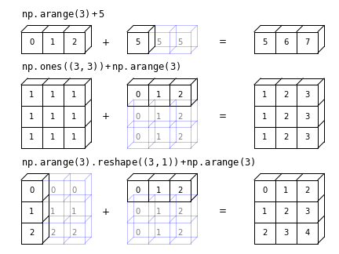

Numpy offers an enormous range of pre-compiled functions in its numerical libraries, which allow a wide 
range of tasks to be completed on large arrays of data with speeds 
comparable to or approaching those of dedicated compiler languages such as Fortran or C++. We
describe some examples of some of these functions here, but you should read the Numpy 
documentation online to find many more. A good general rule is that if you can think of a numerical
method or function that you want to use, it is already implemented in numpy (or possibly
scipy). So googling  what you want to do together with the terms numpy or scipy is a good 
way to find what you need.

## More on Numpy Ufuncs

Numpy _ufuncs_ are pre-compiled (usually in C) functions that that operate on _ndarray_ type 
objects (i.e. numpy arrays). They operate element-wise (item by item) on the array and support _type casting_ 
(python will try to make non matching data types work) and _broadcasting_ (i.e. python will try to 
make different array shapes work, see below). Most mathematical functions are available (we 
include some examples in this Episode and elsewhere in this lesson) and it's also possible 
to [write your own](https://numpy.org/doc/stable/user/c-info.ufunc-tutorial.html).

Ufuncs which operate on arrays come in two main flavours: unary ufuncs operate on a single array,
while binary ufuncs operate on a pair of arrays. An example of binary ufuncs are the standard 
mathematical operators, which are _wrappers_ for the underlying numpy functions:

~~~
import numpy as np

a = np.linspace(10,50,5)
b = np.arange(5)
print("a =",a)
print("b =",b,"\n")

print("a + b =",a+b,"is the same as np.add(a,b) =",np.add(a,b))
print("a - b =",a-b,"is the same as np.subtract(a,b) =",np.subtract(a,b))
print("-a =",-a,"is the same as np.negative(a) =",np.negative(a))
print("a * b =",a*b,"is the same as np.multiply(a,b)=",np.multiply(a,b))
print("a / b =",a/b,"is the same as np.divide(a,b)=",np.divide(a,b))
print("a // b =",a//b,"is the same as np.floor_divide(a,b)=",np.floor_divide(a,b))
print("a**b =",a**b,"is the same as np.power(a,b)=",np.power(a,b))
print("a % b =",a%b,"is the same as np.mod(a,b)=",np.mod(a,b))
~~~
{: .language-python}
~~~
a = [10. 20. 30. 40. 50.]
b = [0 1 2 3 4] 

a + b = [10. 21. 32. 43. 54.] is the same as np.add(a,b) = [10. 21. 32. 43. 54.]
a - b = [10. 19. 28. 37. 46.] is the same as np.subtract(a,b) = [10. 19. 28. 37. 46.]
-a = [-10. -20. -30. -40. -50.] is the same as np.negative(a) = [-10. -20. -30. -40. -50.]
a * b = [  0.  20.  60. 120. 200.] is the same as np.multiply(a,b)= [  0.  20.  60. 120. 200.]
a / b = [        inf 20.         15.         13.33333333 12.5       ] is the same as np.divide(a,b)= [        inf 20.         15.         13.33333333 12.5       ]
a // b = [nan 20. 15. 13. 12.] is the same as np.floor_divide(a,b)= [nan 20. 15. 13. 12.]
a**b = [1.00e+00 2.00e+01 9.00e+02 6.40e+04 6.25e+06] is the same as np.power(a,b)= [1.00e+00 2.00e+01 9.00e+02 6.40e+04 6.25e+06]
a % b = [nan  0.  0.  1.  2.] is the same as np.mod(a,b)= [nan  0.  0.  1.  2.]
~~~
{: .output}

Writing these operations using the common mathematical operators is quicker than using the full 
numpy function names - and they follow the usual mathematical rules for order of operation, with powers calculated first, then division and multiplication then addition and subtraction. But you should remember that these are array operations and not operations on single variables!

> ## Broadcasting
>
> Binary ufuncs operate on two arrays (e.g. addition or multiplication of two arrays, to give a simple
> example). If the arrays have the same shape (same number of dimensions, each with the same 
> size) the operation is applied to the corresponding pairs of elements in the array (i.e. the pair of 
> elements with the same indices). 
>
> However, a great advantage of numpy's arrays and ufuncs is
> that they allow _broadcasting_. Numpy's _broadcasting_ rules allow 
> binary ufuncs to be applied to arrays of different shapes, provided that the shape of the 
> smaller array can be mapped on to the same shape as the larger array in an unambiguous way.
> The broadcasting rules can be simplified to:
>
> 1. If both arrays have a different number of dimensions, the shape of the one with fewer 
> dimensions is padded (on the left side of the shape tuple) with dimensions of size 1 so
> that the dimensions are now matched.
>
> 2. If the shapes are not the same in any dimension, the array with size 1 in that 
> dimension is extended in size (repeating the same values), to match the other array.
>
> 3. However, if the sizes in a given dimension don't match and neither is equal to 1
> an error is raised.
>
> The figure below (created using the code 
> [here](https://jakevdp.github.io/PythonDataScienceHandbook/06.00-figure-code.html#Broadcasting)) shows examples of successful broadcasting.
>
> 

> 
> 

>
{: .callout}

> ## Challenge
> 
> Write a function that can take an input array of dates expressed with integer type as
> YYYYMMDD (e.g. 19950325, as read in by `genfromtxt` from the KNMI data set) and 
> returns three separate arrays of year, month and the day of the month. 
> To calculate these quantities you should use only the numpy functions corresponding to standard 
> mathematical operations with math symbol wrappers (see above).
>
>> ## Hint
>> To get you started, this is how you can find the year:  `year = date // 10**4`
> {: .solution}
>
>> ## Solution
>> ~~~
>> def get_ymd(date):
>>     '''Takes as input the date as integer type YYYYMMDD and returns year, month 
>>     (as integer 1-12) and day of the month'''
>>
>>     year = date // 10**4
>>     month = date // 10**2 % 100
>>     day = date % 100
>> 
>>     return year, month, day
>> ~~~
>> {: .language-python}
> {: .solution}
{: .challenge}

## Common mathematical functions

Besides the common mathematical operators, there are ufuncs for all of the common mathematical 
functions. E.g.:

~~~
print("Square root of a:",np.sqrt(a))
print("Exponential of b:",np.exp(b))
print("log_10(a) =",np.log10(a)) # Log in base 10
print("ln(a) =",np.log(a)) # Natural log
print("log_2(a) =",np.log2(a)) # Log in base 2
print("\n\n")
      
angles = np.linspace(0.,2*np.pi,10) # Pi can be called with np.pi
print("Angles in radians:",angles)
print("Angles in degrees:",np.degrees(angles)) # To go from degrees to radians, use np.radians

print("tan(b): ",np.tan(a)) # Functions include inverse (arctan etc.) and other trig functions
~~~
{: .language-python}
~~~
Square root of a: [3.16227766 4.47213595 5.47722558 6.32455532 7.07106781]
Exponential of b: [ 1.          2.71828183  7.3890561  20.08553692 54.59815003]
log_10(a) = [1.         1.30103    1.47712125 1.60205999 1.69897   ]
ln(a) = [2.30258509 2.99573227 3.40119738 3.68887945 3.91202301]
log_2(a) = [3.32192809 4.32192809 4.9068906  5.32192809 5.64385619]

Angles in radians: [0.         0.6981317  1.3962634  2.0943951  2.7925268  3.4906585
 4.1887902  4.88692191 5.58505361 6.28318531]
Angles in degrees: [  0.  40.  80. 120. 160. 200. 240. 280. 320. 360.]
tan(b):  [ 0.64836083  2.23716094 -6.4053312  -1.11721493 -0.27190061]
~~~
{: .output}

> ## Conditional functions
> 
> There are also a large number of useful numpy functions for manipulating and
> selecting from arrays. For example `numpy.where` allows the user to set a condition to be applied
> to each element of the array (given by the first argument), with two different results to be applied, 
> according to whether the 
> condition is satisfied or not (second and third argument respectively). For 
> example, what function would the following code produce?
>
>~~~
> t = np.linspace(0,10*np.pi,1000)
> a = np.sin(t)
> b = np.where(a > 0,1,0)
> 
> plt.figure()
> plt.plot(t,b)
> plt.xlabel('t',fontsize=12)
> plt.ylabel('b',fontsize=12)
> plt.show()
>~~~
> {: .language-python}
> 
>> ## Solution
>>
>> 

>> 
>> 

>>
>> 
A square wave function!

>>
>> In this case, constants were given as the results for the `True` or `False` cases of the condition,
>> but functions could also be specified instead.
> {: .solution}
>
{: .challenge}

## Random numbers and statistics

Numpy's numerical libraries include a large number of functions that are useful for statistical simulations (e.g. generating random numbers), as well as calculating standard statistical quantities. For example, random numbers can be generated for a large number of simulations using `numpy.random` and suffixing with the required distribution (and its arguments - see the numpy documentation for details). E.g.:

~~~
a = np.random.normal(size=10) # drawn from normal distribution (mean 0, standard deviation 1)
b = np.random.uniform(2,6,size=10) # drawn from uniform distribution with min. 2, max. 6

print("a = ",a,"\n")
print("b =",b)
~~~
{: .language-python}

The random numbers will change every time you generate them, so they won't match the example 
values shown below. To prevent this you could fix the random number generating 'seed' to the 
same value each time (e.g. using `numpy.random.seed`). Fixing random number seeds is generally 
a bad idea, as you almost always need your generated values to be statistically independent 
each time.

~~~
a =  [-0.30022351 -0.2436521   0.82529598  1.45559054  2.81468678  0.63432945
  0.45292206 -0.7189043  -1.5688999  -2.07679378] 

b = [4.91409402 5.20504639 4.10317644 4.52392586 4.12252377 5.19390016
 2.63697377 2.09074333 5.82355927 5.00880279]
~~~
{: .output}

There are a large number of functions to calculate statistical properties of data, e.g.:

~~~
mean = np.mean(a)
std_dev = np.std(a,ddof=1)
median = np.median(a)

# For the standard deviation of a sample, the degrees of freedom ddof=1 
print("For a, mean =",np.mean(a),"median =",np.median(a),"and standard deviation =",np.std(a,ddof=1))
print("For b, mean =",np.mean(b),"median =",np.median(b),"and standard deviation =",np.std(b,ddof=1))

# The statistical quantities for a large random sample should be closer to the population ('true') values:
c = np.random.normal(size=100000)
d = np.random.uniform(2,6,size=100000)

print("For c, mean =",np.mean(c),"median =",np.median(c),"and standard deviation =",np.std(c,ddof=1))
print("For d, mean =",np.mean(d),"median =",np.median(d),"and standard deviation =",np.std(d,ddof=1))
~~~
{: .language-python}
~~~
For a, mean = 0.1274351220779665 median = 0.10463498050131667 and standard deviation = 1.4379104160216345
For b, mean = 4.36227458161702 median = 4.719009939469249 and standard deviation = 1.1807239934047047
For c, mean = -0.003106470300092659 median = -0.0020945245248079037 and standard deviation = 1.0019999302839593
For d, mean = 4.00191762092067 median = 4.001883767677743 and standard deviation = 1.1542783586377883
~~~
{: .output}

For multi-dimensional data sets the default is to flatten the array and calculate a single statistical 
quantity for all the values, but by specifying the axis as an integer or tuple of integers, quantities can be calculated along specific dimensions of the array. This can be useful if you want to arrange your data into
many sub-samples corresponding to, e.g. columns in the array, and calculate separate statistical quantities
for each sub-sample. For example:

~~~
x = np.linspace(1,6,10)
y = np.random.normal(x,np.sqrt(x),size=(20,10)) # Mean and standard deviation increase with x

y_mean = np.mean(y,axis=0) # Measure mean along each column of 20 values
y_std = np.std(y,axis=0,ddof=1) # Measure standard deviation

print("Means =",y_mean)
print("Standard deviations =",y_std)
~~~
{: .language-python}

~~~
Means = [1.10406239 1.79198285 2.41687801 2.61184147 2.37594309 3.46102472 4.72351714 4.66671086 4.68688962 6.8386863 ]
Standard deviations = [1.21478777 1.46095133 1.53221715 1.89578884 1.66559555 2.28753281 1.90451327 2.55568894 2.19337894 2.31425862]
~~~

Numpy functions like these can be used to handle data sets, but for more extensive analysis,
especially with large and complex data sets Pandas (which
is based in large part on numpy and scipy) is a more suitable and versatile library.

> ## Masked Arrays
> 
> In some situations your array may contain elements with no data, bad data, or data which you
> wish to filter from your analysis for some other reason. You can remove this data using a condition
> to filter out the elements you don't want, but this only works if the resulting array can be flattened
> and you don't need to preserve its shape. However, if you want to keep the shape of your data 
> array (e.g. for statistical calculations along a particular axis), it is useful to create a _masked array_.
> These can be created using the `numpy.ma` module, which also includes equivalents of common 
> numpy functions that can be applied to masked arrays (for which the usual `numpy` functions
> will not work).
> 
> First, we will add some `nan` values in random locations in the `y` array we generated previously:
> 
> ~~~
> # First randomly select indices of elements from y to change values to NaN in new array y2
> cols = np.random.random_integers(0,9,size=20)
> rows = np.random.random_integers(0,19,size=20)
> y2 = np.copy(y)
> y2[rows,cols] = np.nan
> 
> y2_mean = np.mean(y2,axis=0) # Measure mean along each column of 20 values
> y2_std = np.std(y2,axis=0,ddof=1) # Measure standard deviation
> 
> print("Means =",y2_mean)
> print("Standard deviations =",y2_std)
> ~~~
> {: .language-python}
> 
> ~~~
> Means = [       nan        nan        nan        nan        nan 3.46102472
>         nan        nan        nan        nan]
> Standard deviations = [       nan        nan        nan        nan        nan 2.28753281
>         nan        nan        nan        nan]
> ~~~
> {: .output}
> 
> Any columns containing `nan` will result in `nan` for the statistics calculated along those columns.
> We can produce a masked array with `nan` values masked. One way to create a masked array is to 
> use the `masked_array` function with a Boolean array of `True`/`False` values with the same 
> shape as the array to be masked, e.g.:
> 
> ~~~
> y2_ma = np.ma.masked_array(y2,np.isnan(y2))
> 
> y2_ma_mean = np.ma.mean(y2_ma,axis=0) # Measure mean along each column of 20 values
> y2_ma_std = np.ma.std(y2_ma,axis=0,ddof=1) # Measure standard deviation
> 
> print("Means =",y2_ma_mean)
> print("Standard deviations =",y2_ma_std)
> ~~~
> {: .language-python}
> 
> ~~~
> Means = [0.8922926559222217 1.679217577416684 2.432410192332734 2.5727061459634673
>  2.2115371803066557 3.4610247170590283 4.475816052299866 4.786879589526783
>  4.743040460933355 6.887791934103876]
> Standard deviations = [1.1636287759233295 1.5121734615501945 1.6169210355493306
>  1.974709637455112 1.5354844835950414 2.2875328102951253
>  1.8266358576564314 2.5670126872971335 2.236916568224871
>  2.3669453874421658]
> ~~~
> {: .output}
> 
> We must be careful with any statistical measures from masked data, in case the 
> missing values cause the measurements to be biased in some way. 
{: .callout}

> ## Using Numpy to calculate with the KNMI data
>
> Now we can use the methods we have looked at above to quickly calculate monthly 
> quantities from the KNMI meteorological data, and plot them. First, read in the data (substituting
> missing values with `-9999`:
>
> ~~~
> data = np.genfromtxt('KNMI_20200825.txt',delimiter=',',comments='#',skip_header=97,names=True,dtype=None,filling_values=-9999)
> ~~~
> {: .language-python}
>
> ## Challenge Part 1
>
> For the first part of the challenge, write a function which takes as input the structured data 
> array read in above, the station number and the name of the variable you want to plot 
> (you can see the variable names using `print data.dtype` to show the field information for
> the structured array). The function should select only the dates and the variable values for that 
> station and when the quantity corresponding to that variable was measured (see the solution to 
> the Challenge at the end of the previous Episode).
>
> Next, the function should recalculate the dates as arrays of integer type for the day, month and 
> year (see the Challenge earlier in this Episode), and assign the values of the variable to a 3-D array,
> where the axes of the array correspond to year (measured since the first year when data was 
> taken), month and day of the month. Before assigning values to the array, create your array so 
> that it is already filled with `nan` values, to identify positions in the array that correspond to dates with
> no data for that variable, or which do not correspond to real dates (such as Feb 31). 
>
> Finally, your function should output the 
> resulting 3-D array as well as the integer value of the first year in the return data array, so that 
> year values corresponding to that axis can be determined (the days and months
> should be self-evident from the indices).
>
> If you find this part too difficult or time consuming, you can look at the solution and skip ahead 
> to the next part. This first part is really focussed on array manipulation using the principles 
> discussed in the previous Episode. The second part focusses on using methods discussed
> in this Episode.
>
>> ## Part 1 Solution
>> ~~~
>> def get_3d_data(data,stn_num,varname):
>>     '''Read in structured data array, station number (int) and variable name (str),
>>     select data for that station and variable only, and then assign the data to a 
>>     3D array where axes correspond to the year, month and day. 
>>     Output: 3D data array and the starting year for the data'''
>>
>>     # First select date and variable values for given station number
>>     data_stn = data[data['STN'] == stn_num] # Select data for that station only
>>     data_stn = data_stn[data_stn[varname] != -9999] # Only include data when the 
>>     selected variable was measured
>>     year, month, day = get_dmy(data_stn['YYYYMMDD'])
>>     variable =  data_stn[varname]
>>
>>     # Now lets define a 3D array for our variable, where each axis corresponds to a 
>>     year, month and day. 
>>     # First, set the dimensions:
>>
>>     y_len = (year[-1]-year[0])+1  # This assumes years are in chronological order
>>     m_len = 12  # 12 months in a year...
>>     d_len = 31 # Allow up to 31, excess days are filled with NaN and we should filter 
>>     them in calculations
>>
>>     # Set up the 3D array:
>>     data_array = np.full((y_len,m_len,d_len),np.nan)
>>
>>     # Now fill the 3D array with the corresponding data values.
>>     # indices start at 0 so days/months should be shifted back by 1
>>     data_array[year-year[0],month-1,day-1] = variable
>>
>>     return data_array, year[0]
>> ~~~
>> {: .language-python}
> {: .solution}
>
> ## Challenge Part 2 
>
> Now write a function that does the following:
> - Takes as input the original structured array produced by `genfromtxt` from the KNMI data file, a station number
> and a list of variable names
> - Looping through the list of variable names, then within the loop:
>     1. Create a 3-D data array using the function written in Part 1 of this Challenge.
>     2. Create a masked version of the 3-D array to ignore the elements with `nan`. 
>     3. Use the masked array to calculate the mean values for the 12 months in the year (i.e. averaging the data over all years 
and days in that month)
>     4. Plot the means vs. month, so that all the variables in the list are plotted in the same plot (use `plt.show()` outside the loop at the end of the function).
> For extra brownie points, add a legend which shows the variable names vs. plot symbol/colour (depending on the type of plot) and
> correct by a factor 10 the variables that are given in tenths of a unit, to show them in the normal units.
>
> Use your function to plot the monthly average of the daily minimum (TN), mean (TG) and maximum (TX) temperatures for a selected 
> station.  
>
>> ## Hint
>>
>> To plot a legend you can include an argument  `label` in the plotting function call (e.g. `plt.plot`), where the value of label
>> is a string, and then include the function `plt.legend()` before plotting.
> {: .solution}
>
>> ## Part 2 Solution
>> ~~~
>> def plot_monthly_allyears(data,stn_num,var_list):
>>     '''Read in the structured data array of KNMI data, station number and list of variables.
>>     
>>     Loops through the list of variables to obtain a 3-D (year,month,day) array for that variable,
>>     masks the array to ignore missing data and calculate the means (over all years) for each month.
>>     Then plot the variable so all appear on the same plot. 
>> 
>>     Does not return anything.'''
>> 
>>     months = ['Jan','Feb','Mar','Apr','May','Jun','Jul','Aug','Sep','Oct','Nov','Dec']
>>     plt.figure()
>>     for i, varname in enumerate(var_list):
>>         # Make 3D array for that variable
>>         data_array, year_start = get_3d_data(data,stn_num,varname)
>>         # Create a masked array to remove nan values
>>         data_array_ma = np.ma.masked_array(data_array,np.isnan(data_array))
>>         if (varname[0] in ('D','U','Q','V') or varname[-1] == 'H' or varname == 'SP'):
>>         # Find the mean value for each month by averaging over all years and days in that month
>>         means = np.ma.mean(data_array_ma,axis=(0,2))
>>         else:
>>         means = 0.1*np.ma.mean(data_array_ma,axis=(0,2))
>>         plt.plot(np.arange(1,13),means,label=varname,marker='o',linewidth=2,linestyle='-')
>>     # These plot commands apply to the whole plot so we can end the loop here
>>     plt.xticks(np.arange(1,13),months)
>>     plt.ylabel("Average Value",fontsize=12)
>>     plt.xlabel("Month",fontsize=12)
>>     plt.legend()
>>     plt.show()
>>     return
>> ~~~
>> {: .language-python}
>> 
>> Now let's plot the temperatures for Eindhoven:
>>
>> ~~~
>> plot_monthly_allyears(data,370,['TX','TG','TN'])  
>> ~~~
>> {: .language-python}
>>
>> 

>> 
>> 

>>
> {: .solution}
{: .challenge}
