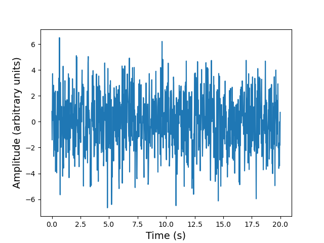
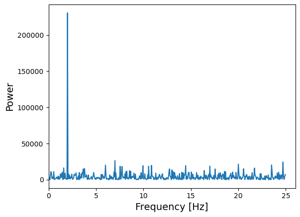

<!-- Just one possible MathJax CDN below. You may use others. -->

## Introducing Scipy

Scipy is a collection of packages and functions based on numpy,
with a goal of performing scientific computation with numerical methods which have similar 
functionality as common numerical languages such as MATLAB, IDL and R. The scipy library 
is heavily integrated with numpy and matplotlib.

Scipy is organised into sub-packages covering different topics - you need to import them
individually. The sub-packages are:

| Sub-package | Methods covered |
|---------------- | ------ |
| `cluster` | Clustering algorithms |
| `constants` | Physical and mathematical constants |
| `fft` | Fast Fourier Transform routines |
| `integrate` | Integration and ordinary differential equation solvers |
| `interpolate` | Interpolation and smoothing splines |
| `io` | Input and Output |
| `linalg` | Linear algebra |
| `ndimage` | N-dimensional image processing |
| `odr` | Orthogonal distance regression |
| `optimize` | Optimization and root-finding routines |
| `signal` | Signal processing |
| `sparse` | Sparse matrices and associated routines |
| `spatial` | Spatial data structures and algorithms |
| `special` | Special functions |
| `stats` | Statistical distributions and functions |
| `mstats` | Statistical functions for masked arrays |

We'll look at some examples here, but the sub-package topics will give you an idea
of where to look for things online, by looking at their documentation. Also, as with numpy, 
you can usually find what you want by combining what you want to do with the names
'scipy', 'numpy' (or just 'Python') in a google search. The trick is figuring out the
formal way to describe what it is that you are trying to do (although a verbal description 
of it will sometimes work!).

> ## Check the function documentation!
>
> It is very important that you always check the documentation for a scipy (or numpy) function 
> before using it for the first time. This is not only to see what inputs the function requires (and what 
> its outputs are),
> but also to check the assumptions that go into the function calculation (e.g. the `curve_fit`
> function require errors on the data to be normally distributed). __You should never use a function
> as a 'black box' without understanding the basics of what it is supposed to do and what
> special conditions are required for the results to make sense__.
>
> For the functions described below, as you go through them take a look at the documentation
> (google the function name
> and 'scipy' but be sure to look at the latest version, or the one suitable for your installation of 
> scipy). You will see that many functions have a lot of other capabilities, including a variety of 
> additional arguments to control how they work, and sometimes additional methods that
> make them more versatile.
{: .callout}

## Interpolation

With the interpolation sub-package you can carry out 1-D interpolation using a variety of techniques
(e.g. linear, cubic), taking as input 1-D arrays of $$x$$ and $$y$$ values and a set of new $$x$$ values, for which the interpolated $$y$$ values should be determined:

~~~
import numpy as np
import matplotlib.pyplot as plt
%matplotlib inline

from scipy.interpolate import interp1d

x = np.linspace(0, 10, num=11, endpoint=True)
y = np.cos(-x**2/9.0)
f = interp1d(x, y)
f2 = interp1d(x, y, kind='cubic')
f3 = interp1d(x, y, kind='nearest')

xnew = np.linspace(0, 10, num=100, endpoint=True)

plt.figure()
plt.plot(x, y, '-o')
plt.plot(xnew, f(xnew), '-') 
plt.plot(xnew, f2(xnew), '--')
plt.plot(xnew, f3(xnew), ':')
plt.plot(x, y, '-o')
plt.xlabel('x',fontsize=14)
plt.ylabel('y',fontsize=14)
plt.tick_params(axis='both', labelsize=12)
plt.legend(['data','linear','cubic','nearest'], loc='best',fontsize=14)
plt.savefig('interpolation.png')
plt.show()
~~~
{: .language-python}

A variety of 1- and N-dimensional interpolation functions are also available.

## Integration

Within `scipy.integrate`, the `quad` function is useful for evaluating the integral of a given 
function, e.g. suppose we  want to integrate any function $$f(x)$$ within the boundaries $$a$$ and 
$$b$$: $$\int_{a}^{b} f(x) dx$$

As a specific example let's try $$\int_{0}^{\pi/2} sin(x) dx$$, which we know must be exactly 1:

~~~
from scipy.integrate import quad

# quad integrates the function using adaptive Gaussian quadrature from the Fortran QUADPACK library

result, error = quad(np.sin, 0, np.pi/2)

print("Integral =",result)
print("Error =",error)
~~~
{: .language-python}

Besides the result, the function also estimates a numerical error (which arises due to the floating
point accuracy, i.e. number of bits used for numbers, in the calculations).

~~~
Integral = 0.9999999999999999
Error = 1.1102230246251564e-14
~~~
{: .output}

## Optimization and model-fitting

The `scipy.optimize` sub-package contains a large number of functions for optimization, i.e.
solving an equation to maximize or minimize (the more common situation) the result. These 
methods are particularly useful for model-fitting, when we want to minimize the difference 
between a set of model predictions and the data itself. To use these fully use these methods, 
accounting for statistical errors, you should study statistical methods and data analysis, 
which is beyond the scope of this course. For now, we introduce a few of these methods
as a primer with a few simple use cases.

First we're going to generate a sine wave time series, adding scatter to the data points
with random numbers drawn from a normal distribution:

~~~
from scipy import optimize

x_data = np.linspace(-5, 5, num=50)
y_data = 2.9 * np.sin(1.5 * x_data) + np.random.normal(size=50)

# We know that the data lies on a sine wave, but not the amplitudes or the period.

plt.plot(x_data,y_data,"o")
plt.figure()
plt.plot(x_data,y_data,"o")
plt.xlabel('x',fontsize=14)
plt.ylabel('y',fontsize=14)
plt.show()
~~~
{: .language-python}

The scatter in the data means that the parameters of the sine-wave cannot be easily determined
from the data itself. A standard approach is to minimise the _squared residuals_ (the residual is 
the difference, _data - model_). Under certain conditions (if the errors are normally distributed),
this _least squares minimization_ can be done using `scipy.optimize`'s `curve_fit` function.

First, we need to define the function we want to fit to the data:

~~~
# Set up a function with free parameters to fit to the data

def test_func(x, a, b):
    return a * np.sin(b * x)
~~~
{: .language-python}

Now we call `curve_fit`, giving as arguments our function name, the data $$x$$ and $$y$$ 
values, and the starting parameters for the model (given as a list or array). 
If no error bars on the data points are specified, `curve_fit` will return the best-fitting 
model parameters which minimize the squared residuals, which we can also use to
plot the best-fitting model together with the data. We will not consider the case where 
error bars are specified (which minimizes the so-called _chi-squared_ statistic) or the 
parameter covariance which is also produced as output (and which can be used to estimate
model parameter). These should be discussed in any course on statistical methods.

~~~
params, params_covariance = optimize.curve_fit(test_func, x_data, y_data, p0=[2, 2])
print("Best-fitting parameters = ",params)

plt.figure()
plt.plot(x_data,y_data,"o")
plt.plot(x_data,test_func(x_data,params[0],params[1]),"r")
plt.xlabel('x',fontsize=14)
plt.ylabel('y',fontsize=14)
plt.show()
~~~
{: .language-python}
~~~
Best fitting parameters: [2.70855704 1.49003739]
~~~
{: .output}

The best-fitting parameters are similar to but not exactly the same as the ones we used to
generate the data. This isn't surprising because the random errors in the data will lead to
some uncertainty in the fitted parameter values, which can be estimated using a full
statistical treatment of the fit results.

Besides model-fitting, we may want to simply find the minimum of a function (if the maximum
is needed, it can usually be found by using minimization with the function to be maximized 
multiplied by -1!). For example, let's find the minimum in this function:

~~~
def f(x):
    return x**2 + 10*np.sin(x)

x = np.arange(-10, 10, 0.1)

plt.figure()
plt.plot(x, f(x))
plt.xlabel('x',fontsize=14)
plt.ylabel('f(x)',fontsize=14)
plt.show() 
~~~
{: .language-python}

For general cases such as this (where we aren't dealing with random errors that require
minimization of squared residuals), we can use methods provided by the `scipy.optimize`
function `minimize`. There are a wide range of optimization methods which `minimize` can use by changing the,
from 'downhill simplex' (such as _Nelder-Mead_) to conjugate gradient methods (e.g. _BFGS_). 
You should look them up to find out how they work. They all have pros and cons.

~~~
result = optimize.minimize(f, x0=0, method='BFGS')

print("Results from the minimization are:",result)

plt.plot(x, f(x))
plt.plot(result.x, f(result.x),"ro",label="minimum")
plt.xlabel('x',fontsize=14)
plt.ylabel('f(x)',fontsize=14)
plt.legend(fontsize=14)
plt.show()
~~~
{: .language-python}

The result obtained by `minimize` is a compound object that contains all the information of the minimization attempt. `result.fun` gives the minimum value of the function and `result.x`
gives the best-fitting model parameters corresponding to the function minimum. The other 
parameters depend on the method used, but may include the Jacobian (1st order
partial derivative of the function, evaluated at the minimum) and the Hessian (2nd order
partial derivative of the function, evaluated at the minimum) or its inverse (related to the 
covariance matrix). The use of the 2nd-order derivatives should be considered in any 
course covering statistical methods applied to data.

~~~
     fun: -7.945823375615215
hess_inv: array([[0.08589237]])
     jac: array([-1.1920929e-06])
 message: 'Optimization terminated successfully.'
    nfev: 18
     nit: 5
    njev: 6
  status: 0
 success: True
       x: array([-1.30644012])
~~~
{: .output}

## Fast Fourier Transforms

Fourier transforms can be used to decompose a complex time-series signal into its component
frequencies of variation, which can yield powerful insights into the nature of the variability process,
or important astrophysical parameters (such as the rotation period of a neutron star, or the orbital 
period of a planet or a binary system). Particularly useful are the class of _Fast Fourier Transforms_ 
(FFT), which use clever numerical methods to reduce the number of operations needed to calculate
a Fourier transform of a time-series of length $$n$$, from $$n^{2}$$ operations to only $$\sim n \ln(n)$$.

Scipy's `fft` sub-package contains a range of FFT functions for calculating 1-, 2- and N-D FFTs, as 
well as inverse FFTs. Note that `scipy.fft` supercedes the former FFT subpackage `scipy.fftpack`. If you have an older version of Scipy, the code below will not work, but it should work if you change the name of the sub-package to `fftpack` (or even better, update your version of Scipy!). 

First, let's simulate a sinusoidal signal with a period of 0.5 s, embedded in Gaussian noise:

~~~
time_step = 0.02  # 0.02 s time bins
period = 0.5  # 0.5 s period

time = np.arange(0, 20, time_step)
sig = (np.sin(2 * np.pi / period * time) + 2.0 * np.random.randn(time.size))

plt.figure()
plt.plot(time, sig)
plt.xlabel('t (s)',fontsize=14)
plt.ylabel('sig',fontsize=14)
plt.show()
~~~
{: .language-python}

You cannot easily see the 0.5 s period in the light curve (this is also true if you zoom in), due to the 
large amplitude of noise added to the signal. Instead, let's calculate the FFT of the signal, and from 
this measure the power, which is the modulus-squared of the complex amplitude of the FFT, and 
scales with the variance contributed to the time-series at each frequency. The resulting plot of power vs. frequency is called a power spectrum, also referred to as a periodogram when used
to look for periodic signals, which will show up as a peak at a particular frequency.

Formally the scipy 1-D FFT function `scipy.fft.fft` calculates the so-called _Discrete Fourier 
Transform_ (DFT) $$y[k]$$ of a contiguous time-series (i.e. measurements contained in equal time bins, with one measurement right after another with no gaps between bins).

For a time-series $$x[n]$$ of length $$N$$, $$y[k]$$ is defined as:

$$y[k] = \sum\limits^{N-1}_{n=0} x[n] \exp\left(-2\pi ikn/N \right)$$

where $$k$$ denotes the frequency bin (and $$i$$ is the imaginary unit). The zero frequency bin 
has an amplitude equal to the sum over all the $$x[n]$$ values. Formally, $$k$$ takes both 
negative and positive values, extending to $$\pm \frac{N}{2}$$ (the so-called _Nyquist frequency_). 
However, for real-valued 
time-series the negative frequency values are just the complex conjugates of the 
corresponding positive-frequency values, so the convention is to only plot the positive frequencies. 
It's important to note however that the results of the `scipy.fft.fft` function are 'packed' in the 
resulting DFT array so that for even $$N$$, the elements $$y[1]...y[N/2-1]$$ contain the positive 
frequency terms
(in ascending frequency order) while elements $$y[N/2]...y[N-1]$$ contain the negative frequency
terms (in order of decreasing absolute frequency). 

Since the DFT does not take any time units, the actual frequencies $$f[k]$$ may be calculated separately 
(e.g. using the `scipy.fft.fftfreq` function). They can also be easily calculated by hand,
since they are simply related to $$k$$ and the duration of the 
time-series via $$f[k]=k/(N\Delta t)$$ where $$\Delta t$$ is the time step corresponding to one 
time-series bin. Thus, the Nyquist frequency corresponds to $$f[N/2] = 1/(2\Delta t)$$ and
only depends on the bin size.

Now that we know what scipy's FFT function will give us, let's calculate it for our noisy
sinusoidal signal.

~~~
from scipy import fft

# The FFT of the signal
sig_fft = fft.fft(sig)

# And the power (sig_fft is of complex dtype), power is the modulus-squared of the FT
power = np.abs(sig_fft)**2

# The corresponding frequencies
sample_freq = fft.fftfreq(sig.size, d=time_step)

# Plot the FFT power, we only plot +ve frequencies (for real time series, -ve frequencies are 
# complex conjugate of +ve). Note that if we don't restrict the index range to sig.size//2,
# the line plotting the power spectrum will wrap around to the negative value of the Nyquist frequency
plt.figure()
plt.plot(sample_freq[:sig.size//2], power[:sig.size//2])
plt.xlim(0,26.)
plt.xlabel('Frequency [Hz]',fontsize=14)
plt.ylabel('Power',fontsize=14)
plt.show()
~~~
{: .language-python}

The sinusoidal signal at 2 Hz frequency is very clear in the power spectrum.

`fft` can also be given a multi-dimensional array as input, so that it will measure multiple FFTs 
along a given axis (the last axis is used as a default). This can be used when multiple FFTs of 
equal-length segments
of a time-series need to be calculated quickly (instead of repeatedly looping over the `fft` function).

Besides the FFT functions in scipy, numpy also contains a suite of FFT functions (in `numpy.fft`).
When searching for periodic signals against a background of white noise (random variations which 
are statistically independent from one to the next), the scipy and numpy functions are useful when 
the time-series consists of contiguous bins. If there are gaps in the time-series however,
the related _Lomb-Scargle periodogram_ can be used. It can be found in Astropy, in the `timeseries` analysis sub-package, as `astropy.timeseries.LombScargle`.

