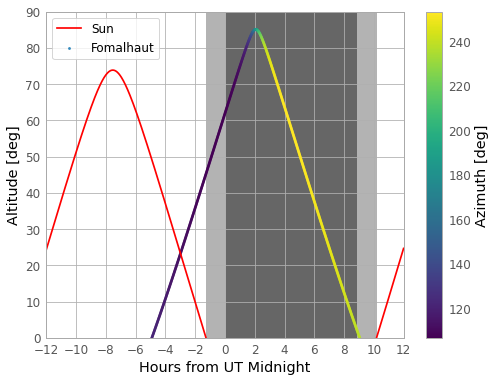

<!-- Just one possible MathJax CDN below. You may use others. -->

## Introducing Astropy

[Astropy](https://www.astropy.org/) is a community-driven Python package containing many tools 
and functions that are useful for doing 
astronomy and astrophysics, from observation planning, data reduction and data analysis to 
modelling and numerical calculations. The astropy core package is included in Anaconda.
in case you don't have it you can install it via `pip` using `pip install astropy` and 
if necessary you can update your Anaconda installation using `conda update astropy`.

The astropy core package is documented [here](https://docs.astropy.org/en/stable/) and includes
a range of sub-packages:

| Sub-package | Methods covered |
|---------------- | ------ |
| `config` | Control parameters used in astropy or affiliated packages |
| `constants` | Physical and astrophysical constants |
| `convolution` | Convolution and filtering |
| `coordinates` | Astronomical coordinate systems |
| `cosmology` | Perform cosmological calculations |
| `io` | Input/output of different file formats (FITS, ASCII, VOTable, HDF5, YAML, ASDF, pickle) |
| `modeling` | Models and model fitting |
| `nddata` | N-dimensional data-sets |
| `samp` | Simple Application Messaging Protocol: allows different catalogues and image viewers to interact |
| `stats` | Astrostatistics tools |
| `table` | Storage and manipulation of heterogeneous data tables using numpy functionality |
| `time` | Time and dates |
| `timeseries` | Time-series analysis |
| `uncertainty` | Uncertainties and distributions |
| `units` | Assigning units to variables and carrying out dimensionally-correct calculations |
| `utils` | General-purpose utilities and functions |
| `visualization` | Data visualization |
| `wcs` | World Coordinate System |

Besides the core packages, astropy maintains a number of separate _coordinated packages_ which
you may need to install separately. These packages are maintained by the astropy package but
they are either too large to be part of the core package, or started out as affiliated packages that
became part of the astropy `ecosystem' so that they need to be maintained directly by the project.

| Coordinated package | Methods covered |
|---------------- | ------ |
| `astropy-healpix` | Pixelization of a sphere (used for astronomical surveys) |
| `astroquery` | Tools for querying online astronomical catalogues and other data sources |
| `ccdproc` | Basic CCD data reduction |
| `photutils` | Photometry and related image-processing tools |
| `regions` | Region handling to allow extraction or masking of data from specific regions of astronomical images |
| `reproject` | Image reprojection, e.g. for comparing and overlaying images which have different coordinate systems (e.g. Galactic vs. RA/Dec) |
| `specutils` | Analysis tools and data types for astronomical spectra |

Alongside the core and coordinated packages, there are a large number of astropy _affiliated 
packages_. These are maintained separately from the main astropy project, but their 
developers/maintainers agree to follow astropy's interface standards and philosophy of 
interoperability. Affiliated packages include packages to help plan observations, calculate the effects of dust extinction on photometric and spectral observations, solve gravitational 
and galactic dynamics problems and analyse data from gamma-ray observatories. 
We won't list them all here - you can find the complete list of all coordinated and 
affiliated packages [here](https://www.astropy.org/affiliated/index.html).

## Units, Quantities and Constants

Astronomical quantities are often given in a variety of non-SI units. Besides the strange
negative-logarithmic flux units of magnitudes (originating in Ancient Greece), for historical reasons,
astronomers often work with cm and g instead of m and kg. There are also a wide range
of units for expressing important astrophysical quantities in more 'manageable' amounts,
such as the parsec (pc) or
Astronomical Unit (AU) for distance, the solar mass unit (M$$_{\odot}$$) or useful
composite units, such as the solar
luminosity (L$$_{\odot}$$). Calculations using different units, or converting between units, can
be made much easier using Astropy's `units` sub-package.

In `astropy.units` a _unit_ represents the physical unit itself, while a _quantity_ corresponds to
a given _value_  combined with the unit it is expressed in. For example:

~~~
import astropy.units as u

v = 30 * u.km/u.s

print(v) # print the quantity v
print(v.unit)  # print the units of v
print(v.value) # print the value of v (it has no units)
~~~
{: .language-python}
~~~
30.0 km / s
km / s
30.0
~~~
{: .output}

You can do mathematics with quantities, and convert from one set of units to another.

~~~
v2 = v + 1700*u.m/u.s 
print(v2) # The new quantity has the units of the quantity from the first term in the sum

mass = 1500*u.kg 

ke = 0.5*mass*v2**2  # Let's calculate the kinetic energy
print(ke) # Multiplication/division results in quantities in composite units

ke_J = ke.to(u.J) # It's easy to convert to different units
print(ke_J)  # And we get the kinetic energy in Joules

print((0.5*mass*v2**2).to(u.J)) # We can also do the conversion on the same line as the calculation

print((0.5*mass*v2**2).si) # And we can also convert to systems of units
~~~
{: .language-python}
~~~
31.7 km / s
753667.5 kg km2 / s2
753667500000.0 J
753667500000.0 J
753667500000.0 m N
~~~
{: .output}

It's also simple to convert to new composite units:

~~~
print*v2.to(u.au/u.h)  # Get v2 in units of AU per hour
~~~
{: .language-python}
~~~
0.000762845082393275 AU / h
~~~
{: .output}

If you want to obtain a dimensionless value, you can use the decompose method:

~~~
print(20*u.lyr/u.au)  # How many AUs is 20 light-years?
print((20*u.lyr/u.au).decompose())
~~~
{: .language-python}
~~~
20.0 lyr / AU
1264821.5416853256
~~~
{: .output}

Note that quantities can only perform calculations that are consistent with their dimensions.
Trying to add a distance to a mass will give an error message!

You can also use units and quantities in array calculations:

~~~
import numpy as np

v2_arr = v + 2000.*np.random.normal(size=10)*u.m/u.s
mass_arr = np.linspace(1000,2000,10)*u.kg

ke_arr = (0.5*mass_arr*v2_arr**2).to(u.J)
print(ke_arr)
~~~
{: .language-python}
~~~
[4.47854216e+11 5.02927405e+11 6.74449284e+11 6.68575939e+11
6.42467967e+11 6.05588651e+11 7.38080377e+11 8.02363612e+11
8.99907525e+11 8.51669433e+11] J
~~~
{: .output}

The capabilities of Astropy `units` are even more useful when combined with the wide range
of constants available in the `constants` sub-package. For example, let's calculate 
a General Relativistic quantity, the gravitational
radius, for a mass of 1 Solar mass (gravitational radius $$R_{g} = GM/c^{2}$$):

~~~
from astropy.constants import G, c, M_sun
print(G,c,M_sun,"\n")  # Printing will give some data about the assumed constants

print("Calculating the gravitational radius for 1 solar mass:")

R_g = G*M_sun/c**2  # Calculate the gravitational radius for 1 solar mass
print(R_g.cgs)  # Default units of constants are SI We can easily convert our result

print(G.cgs*M_sun.cgs/c.cgs**2) # We can also convert constants to cgs
~~~
{: .language-python}
~~~
  Name   = Gravitational constant
  Value  = 6.6743e-11
  Uncertainty  = 1.5e-15
  Unit  = m3 / (kg s2)
  Reference = CODATA 2018   Name   = Speed of light in vacuum
  Value  = 299792458.0
  Uncertainty  = 0.0
  Unit  = m / s
  Reference = CODATA 2018   Name   = Solar mass
  Value  = 1.988409870698051e+30
  Uncertainty  = 4.468805426856864e+25
  Unit  = kg
  Reference = IAU 2015 Resolution B 3 + CODATA 2018 

Calculating the gravitational radius for 1 solar mass
147662.5038050125 cm
147662.50380501247 cm
~~~
{: .output}

The Astropy documentation for `units` and `constants` lists all the available units and constants,
so you can calculate gravitational force in units of solar mass Angstrom per fortnight$$^{2}$$ if you wish!

> ## Challenge
>
> The Stefan-Boltzmann law gives the intensity (emitted power per unit area) of a blackbody of 
> temperature $$T$$ as: $$I = \sigma_{\rm SB} T^{4}$$. A blackbody spectrum peaks at a
> wavelength $$\lambda_{\rm peak} = b/T$$, where $$b$$ is Wien's displacement constant.
> 
> By using `astropy.units` and importing from `astropy.constants` only the two constants 
> $$\sigma_{\rm SB}$$ and $$b$$, calculate and
> print in a single line of code the peak wavelength (__in Angstroms__) of the blackbody emission from the sun. You may 
> also use `numpy.pi` 
> and can assume that the entire emission from the sun is emitted as a blackbody spectrum with
> a single temperature.
>
>> ## Hint 1
>> 
>> The solar constants you need are also provided in `astropy.units`
> {: .solution}
>
>> ## Hint 2
>> 
>> We must rearrange $$L_{\odot} = 4\pi R_{\odot}^2 I$$, then apply the Stefan-Boltzmann and
>> Wien's displacement laws to get the wavelength.
> {: .solution} 
>
>> ## Solution
>> ~~~
>> from astropy.constants import sigma_sb, b_wien
>> 
>> print((b_wien/((u.L_sun/(sigma_sb*4*np.pi*u.R_sun**2))**0.25)).to(u.angstrom))
>> ~~~
>> {: .language-python}
>> ~~~
>> 5020.391950178645 Angstrom 
>> ~~~
>> {: .output}
> {: .solution}
{: .challenge}

## Cosmological Calculations

When observing or interpreting data from sources at cosmological distances, it's necessary to
take account of the effects of the expanding universe on the appearance of objects, 
due to both their recession velocity (and hence, redshift) and the effects of the expansion of 
space-time. Such effects depend on the assumed cosmological model (often informed by
recent cosmological data) and can be calculated using the Astropy `cosmology` sub-package.

To get started, we need to specify a cosmological model and its parameters.  For ease-of-use, these can correspond to a specific set of parameters which are the best estimates measured by either the _WMAP_ or _Planck_ microwave background survey missions, assuming a flat _Lambda-CDM_ model (cold dark matter with dark energy represented by a cosmological constant).
The cosmological model functions include the method `.H(z)` which returns the value of the
Hubble constant $$H$$ at redshift $$z$$.

~~~
from astropy.cosmology import WMAP9 as cosmo
print(cosmo)
print("Hubble constant at z = 0, 3:",cosmo.H(0),",",cosmo.H(3),"\n")

from astropy.cosmology import Planck15 as cosmo
print(cosmo)
print("Hubble constant at z = 0, 3:",cosmo.H(0),",",cosmo.H(3))
~~~
{: .language-python}
~~~
FlatLambdaCDM(name="WMAP9", H0=69.3 km / (Mpc s), Om0=0.286, Tcmb0=2.725 K, Neff=3.04, m_nu=[0. 0. 0.] eV, Ob0=0.0463)
Hubble constant at z = 0, 3: 69.32 km / (Mpc s) , 302.72820545374975 km / (Mpc s) 

FlatLambdaCDM(name="Planck15", H0=67.7 km / (Mpc s), Om0=0.307, Tcmb0=2.725 K, Neff=3.05, m_nu=[0.   0.   0.06] eV, Ob0=0.0486)
Hubble constant at z = 0, 3: 67.74 km / (Mpc s) , 306.56821664118934 km / (Mpc s)
~~~
{: .output}

Note that the parameters in cosmological models are Astropy _quantities_ with defined units - the 
same goes for the values calculated by the cosmological functions.

It's also possible to specify the parameters of the model. There are a number of base classes
for doing this. They must be imported and then called to define the cosmological parameters, e.g.:

~~~
from astropy.cosmology import FlatLambdaCDM  # Flat Lambda-CDM model
# Specify non-default parameters - it's recommended (but not required) to assign
# units to these constants
cosmo = FlatLambdaCDM(H0=70 * u.km / u.s / u.Mpc, Tcmb0=2.725 * u.K, Om0=0.3) 
print(cosmo) 
print("Hubble constant at z = 0, 3:",cosmo.H(0),",",cosmo.H(3))
~~~
{: .language-python}
~~~
FlatLambdaCDM(H0=70 km / (Mpc s), Om0=0.3, Tcmb0=2.725 K, Neff=3.04, m_nu=[0. 0. 0.] eV, Ob0=None)
Hubble constant at z = 0, 3: 70.0 km / (Mpc s) , 312.4364259948698 km / (Mpc s)
~~~
{: .output}

There are a number of other classes, all based on an isotropic and homogeneous 
(Friedmann-Lemaitre-Robertson-Walker - FLRW) cosmology and different forms of dark energy.

We'll assume the Planck15 cosmology for the remaining calculations.  For example, we 
want to determine the age of the universe at a number of redshifts:

~~~
from astropy.cosmology import Planck15 as cosmo

ages = cosmo.age([0,1,2,3])
print(ages)
~~~
{: .language-python}
~~~
[13.7976159   5.86254925  3.28395377  2.14856925] Gyr
~~~
{: .output}

Or we could find the _luminosity distance_ at given redshifts (the effective distance
for calculating the observed flux from an object using the inverse-square law). For example, an 
X-ray instrument measures X-ray fluxes (in cgs units) for 3 quasars with known redshifts, which we want to convert to luminosities:

~~~
z = [0.7,4.0,2.0]  # Quasar redshifts
flux_xray = [2.3e-12,3e-13,5.5e-13] * u.erg/(u.cm**2 * u.s) # We need to give correct units
print("X-ray fluxes =",flux_xray)

lum_dist = cosmo.luminosity_distance(z)
print("Luminosity distances = ",lum_dist)

lum_xray = flux_xray * 4*np.pi*lum_dist.to(u.cm)**2
print("X-ray luminosities = ",lum_xray)
~~~
{: .language-python}
~~~
X-ray fluxes = [2.3e-12 3.0e-13 5.5e-13] erg / (cm2 s)
Luminosity distances =  [ 4383.73875509 36697.036387   15934.6156438 ] Mpc
X-ray luminosities =  [5.28844656e+45 4.83386140e+46 1.67092451e+46] erg / s
~~~
{: .output}

## Observation Planning

Astropy has a number of useful functions to allow the planning of observations from the
ground. For example, suppose we want to observe the star Fomalhaut from one of the _VLT_
telescopes in Paranal, Chile. We want to work out when Fomalhaut will be visible from Paranal
and how high in the sky it will be, to find out when we can observe it with the minimum air-mass 
along the line of sight.

~~~
from astropy.coordinates import SkyCoord, EarthLocation, AltAz

# Lets observe the star Fomalhaut with the ESO VLT - 8m Telescope in Chile
# Load the position of Fomalhaut from the Simbad database

fomalhaut = SkyCoord.from_name('Fomalhaut')

print("Sky coordinates of Fomalhaut:",fomalhaut)

# Load the position of the Observatory. Physical units should be assigned via the
# units function
paranal = EarthLocation(lat=-24.62*u.deg, lon=-70.40*u.deg, height=2635*u.m) 

print("Geocentric coordinates for Paranal: ",paranal)  # The coordinates are stored as geocentric (position
# relative to earth centre-of-mass) as a default
~~~
{: .language-python}
~~~
Sky coordinates of Fomalhaut: <SkyCoord (ICRS): (ra, dec) in deg
    (344.41269272, -29.62223703)>
Geocentric coordinates for Paranal:  (1946985.07871218, -5467769.32727434, -2641964.6140713) m
~~~
{: .output}

Now let's say that we want to observe Fomalhaut and have been assigned observing time
on the night of Oct 14 2020. We will determine the position
in the sky as seen from Paranal over a 24 hour window centred on local midnight on that night. 
Note that a given date _starts_ at 00:00:00, so the date we need is Oct 15 2020.

~~~
from astropy.time import Time

midnight = Time('2020-10-15 00:00:00')
# Define grid of times to calculate position over:
delta_midnight = np.linspace(-12, 12, 1000)*u.hour 

times_Oct14_to_15 = midnight + delta_midnight

# Set up AltAz reference frame for these times and location
frame_Oct14_to_15 = AltAz(obstime=times_Oct14_to_15, location=paranal)

# Now we transform the Fomalhaut object to the Altitute/Azimuth coordinate system

fomalhaut_altazs_Oct14_to_15 = fomalhaut.transform_to(frame_Oct14_to_15)
~~~
{: .language-python}

We should also check the position of the sun in the Paranal sky over the same times 
(since this will determine whether the source is visible at night-time from this location):

~~~
from astropy.coordinates import get_sun

sunaltazs_Oct14_to_15 = get_sun(times_Oct14_to_15).transform_to(frame_Oct14_to_15)
~~~
{: .language-python}

Finally, we can plot the night-time observability of Fomalhaut from Paranal over this time range.
We will import and use an Astropy matplotlib style file from `astropy.visualization` in order to
make the plot look nicer (specifically, it will add a useful grid to the plot).

~~~
import matplotlib.pyplot as plt

from astropy.visualization import astropy_mpl_style
plt.style.use(astropy_mpl_style)

plt.figure()
# Plot the sun altitude
plt.plot(delta_midnight, sunaltazs_Oct14_to_15.alt, color='r', label='Sun')
# Plot Fomalhaut's alt/az - use a colour map to represent azimuth
plt.scatter(delta_midnight, fomalhaut_altazs_Oct14_to_15.alt, 
            c=fomalhaut_altazs_Oct14_to_15.az, label='Fomalhaut', lw=0, s=8,
            cmap='viridis')
# Now plot the range when the sun is below the horizon, and at least 18 degrees below 
# the horizon - this shows the range of twilight (-0 to -18 deg) and night (< -18 deg)
plt.fill_between(delta_midnight.to('hr').value, 0, 90,
                 sunaltazs_Oct14_to_15.alt < -0*u.deg, color='0.7', zorder=0)
plt.fill_between(delta_midnight.to('hr').value, 0, 90,
                 sunaltazs_Oct14_to_15.alt < -18*u.deg, color='0.4', zorder=0)
plt.colorbar().set_label('Azimuth [deg]')
plt.legend(loc='upper left')
plt.xlim(-12, 12)
plt.xticks(np.arange(13)*2 -12)
plt.ylim(0, 90)
plt.xlabel('Hours from UT Midnight')
plt.ylabel('Altitude [deg]')
plt.savefig('Fomalhaut_from_Paranal')
plt.show()
~~~
{: .language-python}

The colour scale shows the range of azimuthal angles of Fomalhaut. Twilight is represented
by the light-grey shaded region, while night is the dark-grey shaded region. The plot shows that
Fomalhaut is high in the Paranal sky earlier in local night-time, so should be observed in the
first few hours of the night for optimum data-quality (since greater azimuth means lower air-mass
along the line of sight to the target).

