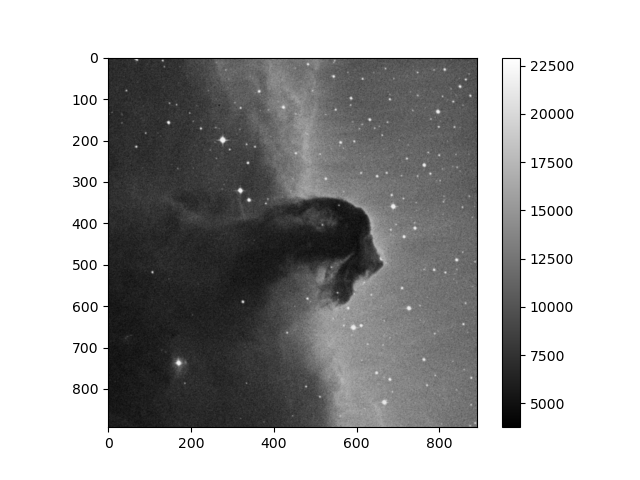

<!-- Just one possible MathJax CDN below. You may use others. -->

## FITS File Structure

The _Flexible Image Transport System_ (_FITS_) is a digital file format which 
can be used to efficiently store tables or multi-dimensional data arrays, such as 2-D images. It was 
designed for astronomical data, so it includes many features optimised for use with 
such data, and is the most common digital file format in use in astronomy. The 
`astropy.io.fits` sub-package allows you to read, manipulate and write FITS formatted data, so 
that in combination with other Python and Astropy functions you can easily work with and analyse
astronomical data.

FITS files are organised in a particular way:
- _Header Data Units_ (HDUs) are the highest-level component of a FITS file, consisting of a _header_ and some type of _data_, which may be a table or a multi-dimensional data-array such as an image. The header contains the 'metadata' which describes the associated data.
- A FITS file may consist of multiple HDUs, the first of which is the _primary HDU_, followed by _extensions_ denoted by an integer starting from 1. The primary HDU is listed as extension 0.

In this episode we will look at how to use `astropy.io.fits` to determine the structure and contents of FITS 
files, and how to read in data and metadata ('header' information) from them. It is also possible to write 
new FITS files, or edit existing ones. We will not describe this here but you can find out more via the official
documentation for `astropy.io.fits` [here](https://docs.astropy.org/en/stable/io/fits/).

Let's take a look at the FITS table file associated with this Episode, `gal_info_dr7_v5_2.fit` (you can download it [here](https://wwwmpa.mpa-garching.mpg.de/SDSS/DR7/Data/gal_info_dr7_v5_2.fit.gz)). This file
contains a large table of data for more than 900 000 galaxies observed as part of the [_Sloan 
Digital Sky Survey_](https://www.sdss.org/) (SDSS). First we will open the file and look at it's 
HDU structure:

~~~
from astropy.io import fits

gals = fits.open('gal_info_dr7_v5_2.fit')
gals.info()
~~~
{: .language-python}
~~~
Filename: gal_info_dr7_v5_2.fit
No.    Name      Ver    Type      Cards   Dimensions   Format
  0  PRIMARY       1 PrimaryHDU       4   ()      
  1                1 BinTableHDU     67   927552R x 25C   [I, J, I, 5I, E, E, 5E, I, I, 19A, 6A, 21A, E, E, I, E, E, E, E, E, E, 3E, 3E, 5E, 12A]   
~~~
{: .output}

We can see that the file consists of two HDUs, the primary (which in this case has no data attached)
and a table (which consists of 927552 _rows_ and
25 _columns_). The `Cards` value lists the quantity of _card images_ which make up the header for the HDU 
and consist of a _keyword name_, a _value_ and an optional) _comment_. Before we move on, we'll take a 
look at the header of the primary HDU, HDU[0], which consists of 4 cards:

~~~
gals[0].header
~~~
{: .language-python}
~~~
SIMPLE  =                    T /Dummy Created by MWRFITS v1.6a                  
BITPIX  =                    8 /Dummy primary header created by MWRFITS         
NAXIS   =                    0 /No data is associated with this header          
EXTEND  =                    T /Extensions may (will!) be present       
~~~
{: .output}

For this particular file, the primary header is just a standard placeholder, which needs to be present 
but doesn't convey any useful information. Other types of FITS data file may contain more extensive
primary headers, e.g. containing important information about the observation (telescope, date, sky 
location) used to take an image or spectrum.  

In case you want to look at the value or comment associated with a keyword:

~~~
print(gals[0].header['BITPIX'])
print(gals[0].header.comments['BITPIX'])
~~~
{: .language-python}
~~~
8
Dummy primary header created by MWRFITS
~~~
{: .output}

Returning to our list of HDUs, we see that HDU[1] has a more extensive header (with 67 cards) __and__ a set 
of dimensions (927552 rows and 25 columns) and data formats corresponding to the table dimensions and the 
formats of the data in the columns therein.

## Working with FITS Table Extensions

Now we'll look at the table extension HDU[1], which contains the data. It's useful first to look at the names
and formats of the columns we have, using the `.columns` method:

~~~
gals[1].columns
~~~
{: .language-python}
~~~
ColDefs(
    name = 'PLATEID'; format = 'I'
    name = 'MJD'; format = 'J'
    name = 'FIBERID'; format = 'I'
    name = 'PHOTOID'; format = '5I'
    name = 'RA'; format = 'E'
    name = 'DEC'; format = 'E'
    name = 'PLUG_MAG'; format = '5E'
    name = 'PRIMTARGET'; format = 'I'
    name = 'SECTARGET'; format = 'I'
    name = 'TARGETTYPE'; format = '19A'
    name = 'SPECTROTYPE'; format = '6A'
    name = 'SUBCLASS'; format = '21A'
    name = 'Z'; format = 'E'
    name = 'Z_ERR'; format = 'E'
    name = 'Z_WARNING'; format = 'I'
    name = 'V_DISP'; format = 'E'
    name = 'V_DISP_ERR'; format = 'E'
    name = 'SN_MEDIAN'; format = 'E'
    name = 'E_BV_SFD'; format = 'E'
    name = 'ZTWEAK'; format = 'E'
    name = 'ZTWEAK_ERR'; format = 'E'
    name = 'SPECTRO_MAG'; format = '3E'
    name = 'KCOR_MAG'; format = '3E'
    name = 'KCOR_MODEL_MAG'; format = '5E'
    name = 'RELEASE'; format = '12A'
)
~~~
{: .output}

The formats `I`, `J`, `E` and `A` denote respectively: 16-bit integers, 32-bit integers, single-precision floats and 
characters 
(i.e. single elements from a string). The digits _N_ in front of a letter format identifier show that that quantity is 
an array with _N_ elements (if an integer or float) or a string with _N_ characters. (note that short descriptions 
of the column data are given on the SDSS galaxy data webpage 
[here](https://wwwmpa.mpa-garching.mpg.de/SDSS/DR7/SDSS_info.html)). 

To access the table data itself, we use the `.data` method:

~~~
gal_data = gals[1].data
~~~
{: .language-python}

The resulting array `gal_data` is a numpy _record_array_: a type of structured array that can have its columns indexed either with their field name (which is simply the column name) _or_ by giving the field name as an _attribute_ (suffix after the record array name). E.g., to use both approaches to print out the redshifts:

~~~
print(gal_data['Z'])
print(gal_data.Z)
~~~
{: .language-python}
~~~
[0.02127545 0.21392463 0.12655362 ... 0.16735837 0.11154801 0.22395724]
[0.02127545 0.21392463 0.12655362 ... 0.16735837 0.11154801 0.22395724]
~~~
{: .output}

The usual indexing and slicing can then be used to access the rows of the column, e.g.:

~~~
print(gal_data.Z[20:25])
~~~
{: .language-python}
~~~
[0.1314682  0.00628221 0.04809635 0.08410355 0.09024068]
~~~
{: .output}

Printing a specific item for one of the quantities that is listed as an array type, will give an array:

~~~
print(gal_data.KCOR_MAG[10])
~~~
{: .language-python}
~~~
[18.97718  18.35391  18.052666]
~~~
{: .output}

## Plotting an image from a FITS file

Image data in FITS files takes the form of a 2-dimensional array where each item corresponds to a pixel value.
For example, let's look at a FITS image of the famous Horsehead nebula. You can find it in the Lesson 
`data` directory [here](https://github.com/philuttley/prog4aa_lesson2)). We'll first open the file and look at
its structure:

~~~
horsehead = fits.open('HorseHead.fits')
horsehead.info()
~~~
{: .language-python}
~~~
Filename: HorseHead.fits
No.    Name      Ver    Type      Cards   Dimensions   Format
  0  PRIMARY       1 PrimaryHDU     161   (891, 893)   int16   
  1  er.mask       1 TableHDU        25   1600R x 4C   [F6.2, F6.2, F6.2, F6.2]   
~~~
{: .output}

The image here (with dimensions 891$$\times$$893 pixels) is in the primary HDU (HDU[0]), while HDU[1] is a 
table with 1600 rows and 4 columns (we won't consider this table further here). To plot the image, we can use
the special matplotlib function `imshow`, which is designed to plot values from 2-D arrays as an image,
using a _colour map_ to denote each value. We will assume a basic grey _colour map_ here, but a wide range
of different colour maps are
available (you can check the matplotlib documentation for details). To indicate how values map on to the
colour map, we also include a _colour bar_ with the plot.

~~~
import matplotlib.pyplot as plt

image_data = horsehead[0].data # Get the data associated with the HDU, same as for a table

plt.figure()
plt.imshow(image_data, cmap='gray')
plt.colorbar()
plt.show()
~~~
{: .language-python}

The image is plotted in terms of the pixel position on the $$x$$ and $$y$$ axes. Astropy contains a range of functions for plotting images in actual sky coordinates, overlaying coordinate grids, contours etc. (e.g. see the documentation for the  `astropy.wcs` and `astropy.visualization` sub-packages).

