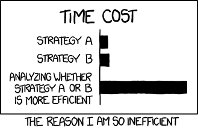

Because of Python's flexibility and large number of libraries, there are often many ways that 
a program can do the same task. Also, the fact that it is an interpreter language can lead to
large differences in speed according to whether a function is carrying out a task sequentially,
i.e. line by line via the interpreter, or using some pre-compiled function to roll the different 
parts of the task into a single function call. For these reasons, it is easy for your code to be
sub-optimal in terms of its speed. When writing Python programs you should spend some
time thinking about whether your code could be made more efficient and/or to run faster.

## Speed-Testing in a Notebook

Within a Jupyter Notebook or from the iPython command line, you can time sections 
of code using the built-in _magic commands_ `%time` and `%timeit`. For example:

~~~
import math

def cos_list(ang_list):
    '''Takes input of a list of angles (in radians) and converts to
       a list of cosines of those angles''' 
    cos_vals = [math.cos(ang) for ang in ang_list]
    return cos_vals

angles = [i*2*math.pi/1000 for i in range(1000)] # Quick way to create a list

%time cosines = cos_list(angles)
~~~
{: .language-python}
~~~
# These examples were tested on a 2.9 GHz Intel Core i5 processor - YMMV

CPU times: user 174 µs, sys: 1 µs, total: 175 µs
Wall time: 178 µs
~~~
{: .output}

Here, the _user CPU time_ is the amount of time the CPU is busy executing the user's code,
while the _system CPU time_ is the amount of time the CPU spends executing other code, e.g.
related to the operating system, such as a system call. The _wall time_ refers to the time taken as
measured by 'a clock on the wall', i.e. the actual time taken from the start of the process to the 
end, accounting for any time waiting for external processes to be run on the CPU.

Since the CPU time can vary from execution to execution (and is dependent on other processes running at the same time), it can be more informative to see an average time 
(and its standard deviation) measured over many iterations of the same executed 
code, which uses `%timeit`:

~~~
%timeit cosines = cos_list(angles)
~~~
{: .language-python}
~~~
126 µs ± 11.7 µs per loop (mean ± std. dev. of 7 runs, 10000 loops each)
~~~
{: .output}

The default number of loops is calculated to give a required precision. The number of runs and loops can also be specified by command line options `-r` and `-n`. If you want to time the code in an entire cell, you should prefix the `%time`/`%timeit` command with an extra `%`, e.g. `%%timeit`.

You can now use `%time` and `%timeit` to time different parts of your code and identify which
are the slowest parts, so you can analyse and possibly speed them up significantly.

> ## IPython Magic Commands
> 
> Magic commands are enhancements to the normal Python code which are intended to solve 
> commons problems and provide shortcuts - they are provided within the iPython kernel and so
> can be used only within notebooks or the iPython command line itself. They are usually prefaced 
> by a `%` character, which means that they operate over the single line of code that follows the 
> command (on the same line). If you want them to operate over the whole cell, you can preface the
> command with `%%`.
> Besides `%time` and `%timeit`, there are many magic commands (see 
> [here](https://ipython.readthedocs.io/en/stable/interactive/magics.html)). A few particularly useful
> ones are:
>
> ### `%who`
> Will display the names that have been used in the notebook (provided that the cells defining them
> have been executed). Adding a data-type, e.g. `%who int` will display only variables of that type.
> The related command `%whos` will give extra information, such as the length of a 
> collection; shape, size, typecode and size in memory of a numpy array.
>
> ### `%%html`
> Renders the cell as a block of HTML code - useful if you want to use fancy HTML formatting. Note that
> this is a cell magic command that by definition is run on the whole cell. Similar commands can be used to
> run javascript, perl or ruby code in cells.
>
> ### `%%writefile`
> A cell magic command to write the content of the cell to a file. E.g.:
>
> ~~~
> %%writefile myprog.py
> def func():
>     print("This is my program!")
>
> func()
> ~~~
> {: .language-python}
> ~~~
> Writing myprog.py
> ~~~
> {: .output}
>
> Note that if you the command will overwrite any existing file with that name. If you instead want 
> to append the code to an existing file, use the `-a` flag, e.g. `%%writefile -a myprog.py`. 
> If you want
> to save a specific set of lines from the cell, instead of the whole cell, 
> you can use the `%save` command instead.
>
> ### `%run`
> Allows you to run any external python file (including another notebook) from a Jupyter notebook. 
> E.g.:
>
> ~~~
> print("Running external program")
>
> %run myprog.py
> ~~~
>{: .language-python}
> ~~~
> Running external program
> This is my program!  
>~~~
>{: .output}
> You can also use relative or absolute paths with the filename of the program to be run (or written).
{: .callout}

## Accelerating Your Code: Lists and Loops vs. Numpy Arrays and Ufuncs

One of the easiest ways to improve the speed of your code is to replace operations which loop
repeatedly over a list of values, with the equivalent pre-compiled numpy functions operating on a 
numpy array or '_ndarray_' (the equivalent of a list or nested list). We will describe how numpy 
arrays work, along with a number of useful functions in the next two Episodes, but for now we will 
see how replacing a loop with a numpy function can make a huge difference to the speed of your 
code.

Universal functions (_ufuncs_) is the general term for a large number of numpy functions designed
to work directly with arrays, many of which are written in compiled C.  It is this aspect, combined
with their often very efficient design for fast calculation of arrays, which makes ufuncs a much faster
option than working with your own equivalent interpreted python, especially when the arrays that
must be looped over are very large.

Let's look again at the example calculation of the cosines of a large list of angles, described above.
Numpy also has a cosine function. We need to remember to convert the input list into a numpy array before we pass it to the numpy function:

~~~
import numpy # unless you have already done so

for n in [1000, 10000, 100000]:
    angles = [i*2*math.pi/n for i in range(n)]
    angles2 = numpy.array(angles) # convert list to numpy array
    %timeit cosines = cos_list(angles)
    %timeit cosines2 = numpy.cos(angles2) # numpy cos ufunc
    print("for",len(angles2),"values in the list/array.\n")
~~~
{: .language-python}
~~~
126 µs ± 7.45 µs per loop (mean ± std. dev. of 7 runs, 10000 loops each)
9.85 µs ± 51.9 ns per loop (mean ± std. dev. of 7 runs, 100000 loops each)
for 1000 items in the list/array.

1.2 ms ± 84.6 µs per loop (mean ± std. dev. of 7 runs, 1000 loops each)
25.6 µs ± 802 ns per loop (mean ± std. dev. of 7 runs, 10000 loops each)
for 10000 items in the list/array.

13.8 ms ± 1.65 ms per loop (mean ± std. dev. of 7 runs, 100 loops each)
134 µs ± 6.71 µs per loop (mean ± std. dev. of 7 runs, 10000 loops each)
for 100000 items in the list/array.
~~~
{: .output}

The run-time of our original list/loop-based function scales close to linearly with the number of
items in the list. However, the numpy function and array runs much more quickly ___and___ 
the run time scales more closely with the square root of the number of items in this case. 
Therefore, much larger gains in speed can be obtained when the lists/arrays used are large. Note
that the exact improvement will depend on the function as well as the size (and dimensionality) of
the arrays used.

The following function reads in a list of values (which must themselves be single numbers) 
and outputs a new list with those values which equal or exceed some lower-limit:

~~~
def select_above(input_list,lower_lim):
    for i, cosine_val in enumerate(input_list):
        if i == 0 and cosine_val >= lower_lim:
            limit_list = [cosine_val]
        elif i > 0 and cosine_val >= lower_lim:
            limit_list.append(cosine_val)
    return limit_list
~~~
{: .language-python}

In numpy we can use a conditional directly on the array, to select the array elements which satisfy the condition and create a new array from them. We can compare the speed of both:

~~~
n = 10000
angles = [i*2*math.pi/n for i in range(n)]
angles2 = numpy.array(angles)

cosines = cos_list(angles)
cosines2 = numpy.cos(angles2)

print("Using a list and loop over a conditional:")
%timeit limit_cosines = select_above(cosines,0.5)

print("Use a conditional to select from a numpy array:")
%timeit limit_cosines2 = cosines2[cosines2 >= 0.5]
~~~
{: .language-python}

~~~
Using list and loop over a conditional:
1.13 ms ± 81.2 µs per loop (mean ± std. dev. of 7 runs, 1000 loops each)
Use a conditional to select from a numpy array:
7.73 µs ± 61.9 ns per loop (mean ± std. dev. of 7 runs, 100000 loops each)
~~~
{: .output}

Again, the numpy solution is much faster than the basic python equivalent!

> ## Vectorization
>  
> Numpy includes a useful function called `vectorize()` which takes as its main argument the 
> name of a python function (e.g. one that you have defined). It returns a callable function that is
> _vectorized_. This means that it can be given arguments that are either nested objects (e.g. lists) 
> or numpy arrays, and then loops over their contents to run the original function on each 
> corresponding set of arguments and return a numpy array or
> tuple of arrays (if the original function contains multiple outputs). In this way, you can easily run
> a function for many values of its arguments without setting up a loop yourself, or convert your
> function into something that works like a numpy function, although it is not pre-compiled.
>  
> Note however, that because they are not pre-compiled, vectorized functions are __not__ a
> replacement for e.g. the use of a combination numpy functions or JIT compilation (see below)
> which can speed up your code significantly. `vectorize()` is more of a convenience for you
> to produce vectorized outputs from your own functions and/or avoid excessive use of loops.
> The looping is done within the vectorized function however, so it remains as slow as other
> functions with use the interpreter line-by-line.
>
> ## Challenge
> Vectorize the `math.cos` function and compare its speed (for 10000 input angles) with the 
> `cos_list` function defined earlier, and `numpy.cos`:
> 
>> ## Solution
>> ~~~
>> cos_vec = numpy.vectorize(math.cos)
>> 
>> n = 10000
>> angles = [i*2*math.pi/n for i in range(n)]
>> angles2 = numpy.array(angles)
>> 
>> print("Using a list and loop over math.cos:")
>> %timeit cosines = cos_list(angles)
>> print("Using an array and numpy:")
>> %timeit cosines2 = numpy.cos(angles2)
>> print("Using an array and vectorized math.cos:")
>> %timeit cosines_vec = cos_vec(angles2)
>> ~~~
>> {: .language-python}
>> ~~~
>> Using a list and loop over math.cos:
>> 1.2 ms ± 7.29 µs per loop (mean ± std. dev. of 7 runs, 1000 loops each)
>> Using an array and numpy:
>> 25 µs ± 143 ns per loop (mean ± std. dev. of 7 runs, 10000 loops each)
>> Using an array and vectorized math.cos:
>> 1.08 ms ± 72.9 µs per loop (mean ± std. dev. of 7 runs, 1000 loops each)
>> ~~~
>> {: .output}
> {: .solution}
{: .challenge}

Of course, when trying to optimise your code, you should bear in mind the aphorism 'the best is the 
enemy of the good' (as neatly summarised in this xkcd cartoon below). Try to assess 
whether your code is good enough for the job you want to do with it and whether it's actually 
worthwhile to spend time on speeding it up.

